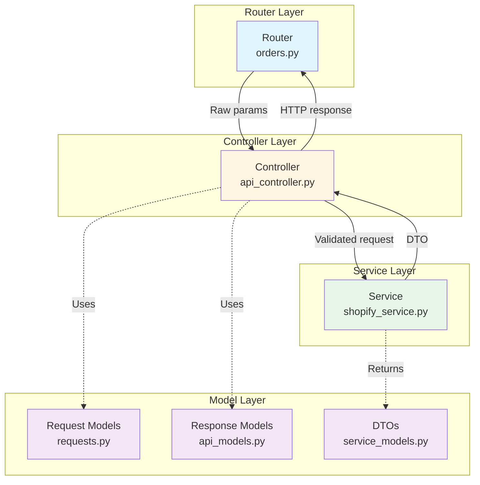
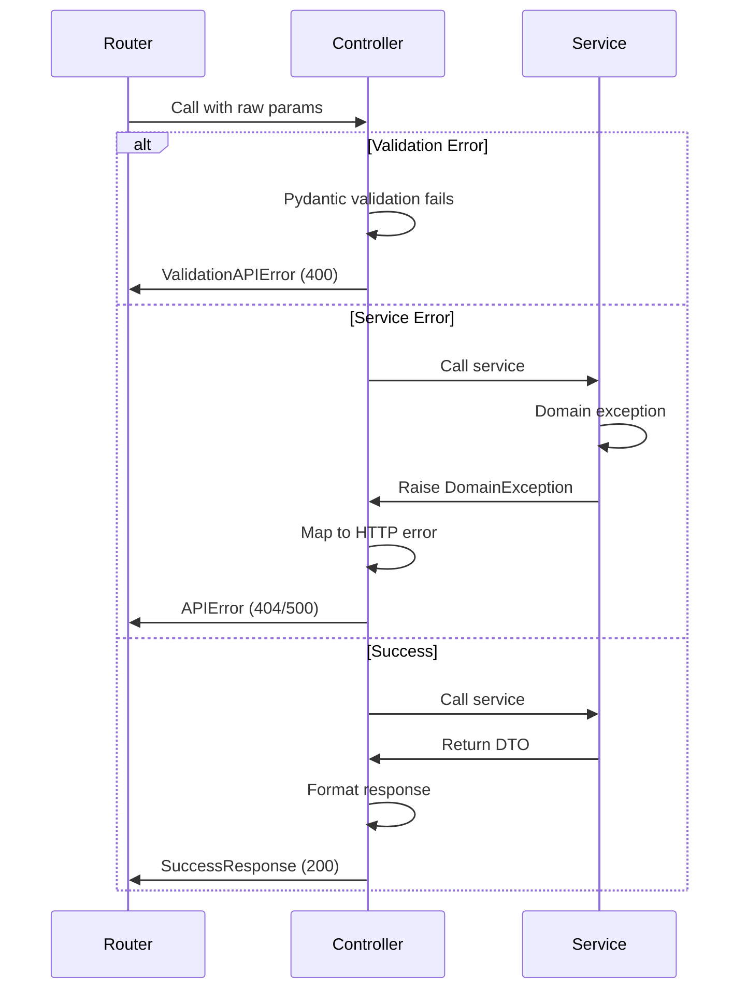

# API Architecture Refactor - Design Document

## Overview

This design establishes a clear three-layer architecture for the backend API following industry-standard MVC/Controller-Service patterns. The refactor moves validation from routers to controllers, establishes consistent response formatting, and creates reusable patterns for future API development.

The orders endpoint will serve as the reference implementation, demonstrating the pattern for other endpoints to follow.

## Architecture

### Three-Layer Architecture



### Layer Responsibilities

#### Router Layer (Thin)
**File:** `backend/routers/orders.py`

**Responsibilities:**
- Define routes and HTTP methods
- Extract raw parameters from request (path, query, body)
- Call controller methods
- Return controller responses directly (Pydantic models)

**Rules:**
- NEVER validate business rules
- NEVER transform data
- NEVER call services directly
- NEVER handle business exceptions
- NEVER contain business logic
- ALWAYS return Pydantic response models (FastAPI serializes automatically)

**Example:**
```python
@router.get("", response_model=SuccessResponse)
async def get_order(
    number: Optional[str] = Query(None, description="Order number (5 digits)"),
    id: Optional[str] = Query(None, description="Order ID (11-16 digits)"),
    reason: Optional[str] = Query(None, description="Operation reason"),
    submitted_at: Optional[str] = Query(None, description="ISO 8601 datetime")
) -> SuccessResponse:
    """Get order details by order number or ID."""
    # Extract raw parameters - NO validation
    # Return Pydantic model - FastAPI serializes to JSON
    return await _shopify_controller.get_order(
        number=number,
        id=id,
        reason=reason,
        submitted_at=submitted_at
    )
```

**Note:** FastAPI automatically:
- Calls `.model_dump()` on the returned Pydantic model
- Serializes to JSON
- Sets appropriate Content-Type headers
- Validates response against `response_model` schema

#### Controller Layer (Orchestration)
**File:** `backend/modules/integrations/shopify/controllers/api_controller.py`

**Responsibilities:**
- Validate ALL request inputs using Pydantic models
- Call appropriate service methods
- Format service responses into HTTP responses
- Map service exceptions to HTTP status codes
- Log requests/responses

**Rules:**
- NEVER contain business logic
- NEVER access databases directly
- NEVER call external APIs directly
- NEVER transform domain data (services return DTOs)
- ALWAYS validate before calling service
- ALWAYS format responses consistently

**Example:**
```python
async def get_order(
    self,
    number: Optional[str] = None,
    id: Optional[str] = None,
    reason: Optional[str] = None,
    submitted_at: Optional[str] = None
) -> OrderResponse:
    """Get order with validation and response formatting."""
    try:
        # 1. Validate inputs using Pydantic
        request = GetOrderRequest(
            number=number,
            id=id,
            reason=reason,
            submitted_at=submitted_at
        )
        
        # 2. Call service with validated data
        order_dto = self.shopify_service.get_order(
            identifier=request.identifier,
            reason=request.reason,
            submitted_at=request.submitted_at
        )
        
        # 3. Format response
        return OrderResponse(**self.format_success_response(
            data=order_dto.model_dump(),
            message="Order retrieved successfully"
        ))
    except ValidationAPIError:
        raise
    except Exception as e:
        raise self.map_exception_to_http_error(e)
```

#### Service Layer (Business Logic)
**File:** `backend/modules/integrations/shopify/services/shopify_service.py`

**Responsibilities:**
- Implement business logic
- Interact with external APIs (Shopify)
- Perform calculations and data enrichment
- Return DTOs (Data Transfer Objects)
- Raise domain exceptions

**Rules:**
- NEVER know about HTTP (status codes, headers, etc.)
- NEVER format responses for HTTP
- NEVER validate HTTP request format
- ALWAYS return DTOs
- ALWAYS raise domain exceptions (not HTTP exceptions)

**Example:**
```python
def get_order(
    self,
    identifier: str,
    reason: Optional[str] = None,
    submitted_at: Optional[str] = None
) -> OrderDTO:
    """Get order and return DTO."""
    # Business logic here
    query_params = self._build_query_params(identifier)
    orders = self.get_order_by_identifier(query_params)
    
    if not orders:
        raise OrderNotFoundError(identifier)
    
    order = orders[0]
    
    # Enrich based on reason
    if reason == "cancel":
        return self._enrich_with_cancellation_info(order)
    elif reason == "refund":
        return self._enrich_with_refund_info(order, submitted_at)
    
    # Return DTO
    return OrderDTO.from_shopify_order(order)
```

## Components and Interfaces

### Request Models (Validation Layer)

**File:** `backend/modules/integrations/shopify/models/requests.py`

Request models handle all input validation using Pydantic. They enforce business rules and return structured validation errors.

**Pattern:**
```python
from pydantic import BaseModel, Field, validator
from shared.api_models import ValidationAPIError

class GetOrderRequest(BaseModel):
    """Request model for getting an order."""
    number: Optional[str] = None
    id: Optional[str] = None
    reason: Optional[str] = None
    submitted_at: Optional[str] = None
    
    @validator('number')
    def validate_number(cls, v):
        if v is not None:
            if not v.isdigit() or len(v) != 5:
                raise ValueError("Order number must be 5 digits")
        return v
    
    @validator('id')
    def validate_id(cls, v):
        if v is not None:
            if not v.isdigit() or not (11 <= len(v) <= 16):
                raise ValueError("Order ID must be 11-16 digits")
        return v
    
    @validator('reason')
    def validate_reason(cls, v):
        if v is not None and v.lower() not in ['cancel', 'refund']:
            raise ValueError("Reason must be 'cancel' or 'refund'")
        return v.lower() if v else None
    
    @validator('submitted_at')
    def validate_submitted_at(cls, v):
        if v is not None:
            try:
                from datetime import datetime
                datetime.fromisoformat(v.replace('Z', '+00:00'))
            except ValueError:
                raise ValueError("submitted_at must be ISO 8601 format")
        return v
    
    @property
    def identifier(self) -> str:
        """Get the identifier (number or id)."""
        if self.id:
            return self.id
        if self.number:
            return self.number
        raise ValidationAPIError(
            "Must provide either 'number' or 'id'",
            field_errors={"identifier": ["Either number or id is required"]}
        )
    
    def model_post_init(self, __context):
        """Validate that exactly one identifier is provided."""
        if not self.number and not self.id:
            raise ValidationAPIError(
                "Must provide either 'number' or 'id'",
                field_errors={"identifier": ["Either number or id is required"]}
            )
        if self.number and self.id:
            raise ValidationAPIError(
                "Cannot provide both 'number' and 'id'",
                field_errors={"identifier": ["Only one identifier allowed"]}
            )
```

### Response Models (HTTP Layer)

**File:** `backend/modules/integrations/shopify/models/api_models.py`

Response models define the HTTP response structure. They inherit from base response models for consistency.

**Pattern:**
```python
from shared.api_models import SuccessResponse
from pydantic import Field
from typing import Dict, Any

class OrderResponse(SuccessResponse):
    """Response model for order operations."""
    data: Dict[str, Any] = Field(default_factory=dict)
    
    @validator('data')
    def validate_order_data(cls, v):
        """Validate and enrich order data."""
        # Add computed fields for CLI/UI display
        if 'id' in v:
            v['url'] = build_shopify_admin_url('orders', v['id'])
        return v
```

### DTOs (Service Layer)

**File:** `backend/modules/integrations/shopify/models/service_models.py` (NEW)

DTOs are pure data structures returned by services. They contain no HTTP knowledge.

**Pattern:**
```python
from pydantic import BaseModel
from typing import Optional, List, Dict, Any
from datetime import datetime

class OrderDTO(BaseModel):
    """Data Transfer Object for orders."""
    id: str
    number: str
    email: Optional[str]
    total_price: str
    currency: str
    financial_status: Optional[str]
    fulfillment_status: Optional[str]
    created_at: datetime
    updated_at: datetime
    cancelled_at: Optional[datetime]
    customer: Optional['CustomerDTO']
    line_items: List['LineItemDTO']
    cancellation_status: Optional['CancellationStatusDTO']
    payment_summary: Optional['PaymentSummaryDTO']
    refund_calculations: Optional['RefundCalculationsDTO']
    
    @classmethod
    def from_shopify_order(cls, order: Any) -> 'OrderDTO':
        """Convert Shopify order object to DTO."""
        return cls(
            id=str(order.id),
            number=str(order.name).lstrip('#'),
            email=str(order.email) if order.email else None,
            # ... map all fields
        )

class CancellationStatusDTO(BaseModel):
    """Cancellation status information."""
    is_eligible: bool
    is_cancelled: bool
    cancelled_at: Optional[datetime]
    cancel_reason: Optional[str]

class PaymentSummaryDTO(BaseModel):
    """Payment summary information."""
    total_paid: str
    total_refunded: str
    refundable_amount: str
    currency: str

class RefundCalculationsDTO(BaseModel):
    """Refund calculation information."""
    refund_to_original: Dict[str, Any]
    refund_to_credit: Dict[str, Any]
```

## Data Models

### Current State

The current implementation mixes concerns:
- Routers do validation
- Controllers do data transformation
- Services return mixed types (dicts, objects, HTTP-aware structures)

### Target State

Clear separation:
- **Request Models**: Pydantic models for validation
- **Response Models**: HTTP response structures
- **DTOs**: Pure data structures from services
- **Domain Models**: Shopify SGQLC objects (internal to service)

### DTO Design Pattern

DTOs follow these principles:

1. **Pure Data**: No methods except factory methods
2. **Immutable**: Use Pydantic's frozen=True where appropriate
3. **Self-Contained**: Include all data needed by controller
4. **Type-Safe**: Full type annotations
5. **Serializable**: Can be converted to dict/JSON easily

**Example DTO Hierarchy:**
```
OrderDTO
├── CustomerDTO
├── LineItemDTO (list)
├── CancellationStatusDTO (optional)
├── PaymentSummaryDTO (optional)
└── RefundCalculationsDTO (optional)
```

## Correctness Properties

*A property is a characteristic or behavior that should hold true across all valid executions of a system—essentially, a formal statement about what the system should do. Properties serve as the bridge between human-readable specifications and machine-verifiable correctness guarantees.*

### Property 1: Validation Error Consistency
*For any* invalid request to any endpoint, the API should return a 400 status code with a response containing `success: false`, a `message` field, and a `field_errors` dictionary mapping field names to error lists.

**Validates: Requirements US-2.2**

### Property 2: Success Response Consistency
*For any* successful API call, the response should contain `success: true`, a `data` field with the response payload, and a `message` field describing the operation.

**Validates: Requirements US-3.1**

### Property 3: Error Response Consistency
*For any* error condition (4xx or 5xx), the response should contain `success: false`, a `message` field describing the error, and optionally an `errors` list with detailed error information.

**Validates: Requirements US-3.2**

### Property 4: Order Endpoint Response Consistency
*For all* order endpoints (GET, DELETE), successful responses should follow the same structure with `success`, `data`, and `message` fields, and error responses should follow the same error structure.

**Validates: Requirements US-4.4**

## Error Handling

### Exception Hierarchy

```
Exception
├── DomainException (base for all domain errors)
│   ├── OrderNotFoundError
│   ├── OrderAlreadyCancelledError
│   ├── InvalidOrderStateError
│   └── RefundCalculationError
├── ValidationAPIError (HTTP 400)
├── NotFoundAPIError (HTTP 404)
└── APIError (HTTP 500)
```

### Error Flow



### Error Mapping Pattern

Controllers map domain exceptions to HTTP exceptions:

```python
def map_exception_to_http_error(self, e: Exception) -> HTTPException:
    """Map domain exceptions to HTTP exceptions."""
    if isinstance(e, OrderNotFoundError):
        raise NotFoundAPIError("Order", e.identifier)
    elif isinstance(e, OrderAlreadyCancelledError):
        raise HTTPException(
            status_code=409,
            detail={"success": False, "message": str(e)}
        )
    elif isinstance(e, InvalidOrderStateError):
        raise HTTPException(
            status_code=422,
            detail={"success": False, "message": str(e)}
        )
    else:
        raise APIError(str(e))
```

## Testing Strategy

### Dual Testing Approach

We use both unit tests and property-based tests for comprehensive coverage:

- **Unit tests**: Verify specific examples, edge cases, and error conditions
- **Property tests**: Verify universal properties across all inputs

### Testing by Layer

#### Router Layer Testing

**Focus**: HTTP routing and parameter extraction

**Unit Tests:**
- Test route definitions
- Test parameter extraction
- Test that router delegates to controller

**Example:**
```python
def test_get_order_route_extracts_parameters():
    """Test that router extracts query parameters correctly."""
    response = client.get("/orders?number=12345")
    # Verify controller was called with correct params
```

#### Controller Layer Testing

**Focus**: Validation and response formatting

**Unit Tests:**
- Test validation with invalid inputs
- Test response formatting
- Test exception mapping

**Property Tests:**
- Test validation error consistency
- Test success response consistency
- Test error response consistency

**Example:**
```python
@given(st.text(), st.text())
def test_validation_errors_are_consistent(number, id):
    """Property: All validation errors return consistent structure."""
    try:
        request = GetOrderRequest(number=number, id=id)
    except ValidationAPIError as e:
        assert e.status_code == 400
        assert "message" in e.detail
        assert "field_errors" in e.detail
```

#### Service Layer Testing

**Focus**: Business logic and DTO creation

**Unit Tests:**
- Test business logic with specific inputs
- Test DTO creation from Shopify objects
- Test error conditions

**Property Tests:**
- Test DTO serialization round-trip
- Test business logic invariants

**Example:**
```python
@given(shopify_order())
def test_dto_round_trip(order):
    """Property: DTO serialization preserves data."""
    dto = OrderDTO.from_shopify_order(order)
    serialized = dto.model_dump()
    deserialized = OrderDTO(**serialized)
    assert dto == deserialized
```

### Property-Based Testing Configuration

- **Library**: Hypothesis (Python)
- **Iterations**: Minimum 100 per property test
- **Tag Format**: `# Feature: api-architecture-refactor, Property {N}: {property_text}`

### Test Organization

```
tests/
├── unit/
│   ├── routers/
│   │   └── test_orders_router.py
│   ├── controllers/
│   │   └── test_shopify_controller.py
│   └── services/
│       └── test_shopify_service.py
└── properties/
    ├── test_validation_properties.py
    ├── test_response_properties.py
    └── test_dto_properties.py
```

## Migration Strategy

### Phase 1: Create DTOs (No Breaking Changes)

1. Create `service_models.py` with DTO definitions
2. Add factory methods to convert Shopify objects to DTOs
3. Service methods continue returning current types
4. No changes to controllers or routers

**Validation**: Existing tests pass

### Phase 2: Create Request Models (No Breaking Changes)

1. Create request models in `requests.py`
2. Add validation logic to request models
3. Controllers continue accepting raw parameters
4. No changes to routers

**Validation**: Existing tests pass

### Phase 3: Refactor Controller (Breaking Changes Contained)

1. Update controller methods to use request models
2. Update controller methods to call service with validated data
3. Update controller methods to format DTO responses
4. Keep router interface unchanged

**Validation**: Update controller tests, router tests pass

### Phase 4: Update Service to Return DTOs (Breaking Changes Contained)

1. Update service methods to return DTOs
2. Remove HTTP-aware code from service
3. Update controller to handle DTOs

**Validation**: Update service tests, controller tests pass

### Phase 5: Simplify Router (Final Step)

1. Remove validation from router
2. Remove exception handling from router
3. Router becomes thin delegation layer

**Validation**: All tests pass, manual testing

### Rollback Strategy

Each phase is independently deployable. If issues arise:
- Phase 1-2: Simply don't use new code
- Phase 3-4: Revert controller/service changes
- Phase 5: Revert router changes

## Before/After Examples

### Example 1: GET Order Endpoint

#### Before (Current)

**Router:**
```python
@router.get("", response_model=SuccessResponse)
async def get_order(
    number: Optional[str] = Query(None, min_length=5, max_length=5),
    id: Optional[str] = Query(None, min_length=11, max_length=16),
    reason: Optional[str] = Query(None),
    submitted_at: Optional[str] = Query(None)
):
    # Validation in router
    if not number and not id:
        raise HTTPException(status_code=400, detail="Must provide number or id")
    if number and id:
        raise HTTPException(status_code=400, detail="Cannot provide both")
    
    # Determine identifier type
    if number:
        identifier = number
        identifier_type = "order_number"
    else:
        identifier = id
        identifier_type = "order_id"
    
    # More validation
    try:
        identifier_request = ShopifyOrderIdentifierRequest(identifier=identifier)
        parsed = identifier_request.parse()
    except ValidationError as e:
        raise HTTPException(status_code=400, detail=str(e))
    
    # Route based on reason
    if reason and reason.lower() == 'cancel':
        result = await _shopify_controller.validate_order_cancellation(identifier, submitted_at)
    elif reason and reason.lower() == 'refund':
        result = await _shopify_controller.validate_order_refund(identifier, submitted_at)
    else:
        result = await _shopify_controller.get_order(identifier)
    
    return result
```

**Controller:**
```python
async def get_order(self, identifier: str) -> OrderResponse:
    try:
        # Parse identifier
        identifier_type, query_str = self._parse_order_identifier(identifier)
        
        # Build query params
        query_params = {
            "query": query_str,
            "first": 1,
            "not_found_message": f"Order not found: {identifier}",
            "identifier": identifier
        }
        
        # Call service
        orders = self.shopify_service.get_order_by_identifier(query_params, line_items_first=50)
        
        if not orders:
            raise NotFoundAPIError("Order", identifier)
        
        order = orders[0]
        
        # Convert to dict (data transformation in controller)
        import json
        if hasattr(order, '__json_data__'):
            order_dict = order.__json_data__
        else:
            order_dict = json.loads(json.dumps(order, default=str))
        
        return OrderResponse(**self.format_success_response(
            data=order_dict,
            message="Order retrieved successfully"
        ))
    except ValidationAPIError:
        raise
    except APIError:
        raise
    except Exception as e:
        raise self.map_exception_to_http_error(e)
```

**Service:**
```python
def enrich_order_with_cancellation_and_refund_info(
    self,
    identifier: Dict[str, Any],
    reason: str,
    submitted_at: Optional[str] = None
) -> Dict[str, Any]:
    # Returns HTTP-aware dict with status_code, success, message
    return {
        "status_code": 200,
        "success": True,
        "message": "Order retrieved",
        "order": order_dict,
        "cancellation_status": {...},
        "payment_summary": {...}
    }
```

#### After (Target)

**Router:**
```python
@router.get("", response_model=SuccessResponse)
async def get_order(
    number: Optional[str] = Query(None, description="Order number (5 digits)"),
    id: Optional[str] = Query(None, description="Order ID (11-16 digits)"),
    reason: Optional[str] = Query(None, description="Operation reason"),
    submitted_at: Optional[str] = Query(None, description="ISO 8601 datetime")
) -> SuccessResponse:
    """Get order details by order number or ID."""
    # Returns Pydantic model - FastAPI serializes to JSON automatically
    return await _shopify_controller.get_order(
        number=number,
        id=id,
        reason=reason,
        submitted_at=submitted_at
    )
```

**Controller:**
```python
async def get_order(
    self,
    number: Optional[str] = None,
    id: Optional[str] = None,
    reason: Optional[str] = None,
    submitted_at: Optional[str] = None
) -> OrderResponse:
    """Get order with validation and response formatting."""
    try:
        # 1. Validate using request model
        request = GetOrderRequest(
            number=number,
            id=id,
            reason=reason,
            submitted_at=submitted_at
        )
        
        # 2. Call service with validated data
        order_dto = self.shopify_service.get_order(
            identifier=request.identifier,
            reason=request.reason,
            submitted_at=request.submitted_at
        )
        
        # 3. Format response
        return OrderResponse(**self.format_success_response(
            data=order_dto.model_dump(),
            message="Order retrieved successfully"
        ))
    except ValidationAPIError:
        raise
    except Exception as e:
        raise self.map_exception_to_http_error(e)
```

**Service:**
```python
def get_order(
    self,
    identifier: str,
    reason: Optional[str] = None,
    submitted_at: Optional[str] = None
) -> OrderDTO:
    """Get order and return DTO."""
    query_params = self._build_query_params(identifier)
    orders = self.get_order_by_identifier(query_params, line_items_first=50)
    
    if not orders:
        raise OrderNotFoundError(identifier)
    
    order = orders[0]
    
    # Enrich based on reason
    if reason == "cancel":
        return self._enrich_with_cancellation_info(order)
    elif reason == "refund":
        return self._enrich_with_refund_info(order, submitted_at)
    
    return OrderDTO.from_shopify_order(order)
```

### Key Improvements

1. **Router**: 80% less code, pure delegation
2. **Controller**: Clear validation → service → format flow
3. **Service**: No HTTP knowledge, returns DTOs
4. **Testability**: Each layer independently testable
5. **Maintainability**: Clear responsibilities, easy to modify

## Implementation Notes

### Pydantic V2 Considerations

The codebase uses Pydantic V2. Key differences:

- Use `model_post_init` instead of `__init__`
- Use `model_dump()` instead of `dict()`
- Use `model_validate()` instead of `parse_obj()`
- Validators use `@field_validator` decorator

### Backward Compatibility

During migration:
- Keep existing methods working
- Add new methods alongside old ones
- Deprecate old methods with warnings
- Remove old methods in final phase

### Performance Considerations

- DTO creation adds minimal overhead (Pydantic is fast)
- Validation happens once in controller (not in router + controller)
- Response formatting is consistent and optimized

### Security Considerations

- All validation in one place (controller)
- No raw user input reaches service
- Consistent error messages (no information leakage)
- Type safety throughout

## References

- FastAPI Best Practices: https://fastapi.tiangolo.com/tutorial/
- Pydantic V2 Documentation: https://docs.pydantic.dev/latest/
- Clean Architecture: https://blog.cleancoder.com/uncle-bob/2012/08/13/the-clean-architecture.html
- Google API Controller Example: `backend/modules/integrations/google/controllers/controller.py`
