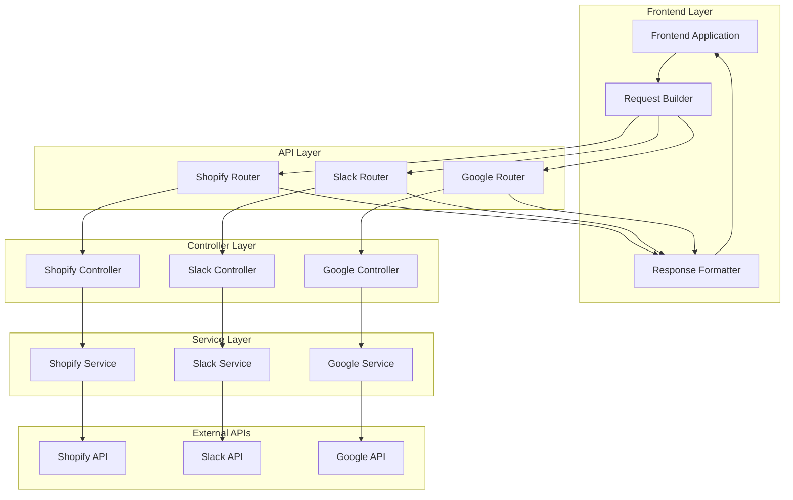

# Design Document: CLI to API Routes

## Overview

This design creates a comprehensive API layer that mirrors the existing CLI commands architecture, enabling frontend applications to access backend functionality through RESTful HTTP endpoints. The solution maintains the same service-oriented architecture as the CLI commands while providing proper HTTP request/response handling, validation, and error management.

The design follows a three-tier architecture:
1. **API Routes** - FastAPI routers that handle HTTP requests and responses
2. **Controllers** - Business logic coordinators that delegate to existing backend services
3. **Backend Services** - Existing service classes that contain the core business logic

## Architecture

### High-Level Architecture



### Service Organization

The API routes will be organized to mirror the CLI command structure:

```
/api/v1/
├── shopify/
│   ├── orders/
│   │   ├── GET /              # List orders
│   │   ├── GET /{identifier}  # Get specific order
│   │   ├── POST /{id}/cancel  # Cancel order
│   │   ├── POST /{id}/refund  # Refund order
│   │   └── POST /{id}/discount # Apply discount
│   ├── products/
│   │   ├── GET /              # List products
│   │   ├── GET /{identifier}  # Get specific product
│   │   └── PUT /{id}          # Update product
│   └── customers/
│       ├── GET /              # List customers
│       ├── GET /{identifier}  # Get specific customer
│       └── PUT /{id}          # Update customer
├── slack/
│   ├── users/
│   │   ├── GET /              # List users
│   │   ├── GET /{identifier}  # Get specific user
│   │   └── PUT /{id}          # Update user
│   ├── groups/
│   │   ├── GET /              # List groups
│   │   ├── GET /{identifier}  # Get specific group
│   │   ├── POST /{id}/members # Add member
│   │   └── DELETE /{id}/members/{user_id} # Remove member
│   └── channels/
│       ├── GET /              # List channels
│       └── GET /{identifier}  # Get specific channel
└── google/
    ├── users/
    │   ├── GET /              # List users
    │   ├── GET /{identifier}  # Get specific user
    │   ├── POST /             # Create user
    │   └── PUT /{id}          # Update user
    ├── groups/
    │   ├── GET /              # List groups
    │   ├── GET /{identifier}  # Get specific group
    │   ├── POST /{id}/members # Add member
    │   └── DELETE /{id}/members/{user_id} # Remove member
    └── sheets/
        ├── GET /{id}          # Read sheet
        ├── PUT /{id}          # Update sheet
        └── POST /{id}/write   # Write to sheet
```

## Components and Interfaces

### API Router Components

Each service will have its own FastAPI router following this pattern:

```python
# Example: backend/routers/api/shopify.py
from fastapi import APIRouter, HTTPException, Depends
from typing import List, Optional, Dict, Any
from backend.controllers.api.shopify import ShopifyAPIController

router = APIRouter(prefix="/api/v1/shopify", tags=["shopify-api"])
controller = ShopifyAPIController()

@router.get("/orders")
async def list_orders(
    limit: Optional[int] = 50,
    offset: Optional[int] = 0,
    status: Optional[str] = None
) -> Dict[str, Any]:
    return await controller.list_orders(limit=limit, offset=offset, status=status)

@router.get("/orders/{identifier}")
async def get_order(identifier: str) -> Dict[str, Any]:
    return await controller.get_order(identifier=identifier)
```

### Controller Components

Controllers will follow the webhook controller pattern but handle API requests:

```python
# Example: backend/controllers/api/shopify.py
from typing import Dict, Any, List, Optional
from backend.modules.integrations.shopify.shopify_service import ShopifyService
from fastapi import HTTPException
import logging

logger = logging.getLogger(__name__)

class ShopifyAPIController:
    def __init__(self):
        self.shopify_service = ShopifyService()
    
    async def get_order(self, identifier: str) -> Dict[str, Any]:
        try:
            # Convert identifier to the format expected by service
            identifier_dict = self._parse_identifier(identifier)
            
            # Call the same service method used by CLI
            order = self.shopify_service.get_order_by_identifier(
                identifier_dict, 
                line_items_first=5
            )
            
            if not order:
                raise HTTPException(status_code=404, detail="Order not found")
            
            # Convert service response to API response format
            return self._format_order_response(order)
            
        except ValueError as e:
            raise HTTPException(status_code=400, detail=str(e))
        except Exception as e:
            logger.error(f"Error getting order {identifier}: {e}")
            raise HTTPException(status_code=500, detail="Internal server error")
```

### Request/Response Models

Pydantic models will define the API contract:

```python
# backend/models/api/shopify.py
from pydantic import BaseModel
from typing import Optional, List, Dict, Any
from datetime import datetime

class OrderResponse(BaseModel):
    id: str
    order_number: str
    email: str
    total_price: str
    currency: str
    financial_status: str
    fulfillment_status: Optional[str]
    created_at: datetime
    line_items: List[Dict[str, Any]]
    customer: Optional[Dict[str, Any]]

class OrderListResponse(BaseModel):
    orders: List[OrderResponse]
    total_count: int
    has_more: bool
    next_offset: Optional[int]

class RefundRequest(BaseModel):
    amount: Optional[float] = None
    reason: Optional[str] = None
    notify_customer: bool = True
    line_items: Optional[List[Dict[str, Any]]] = None
```

## Data Models

### Identifier Handling

The API will support the same identifier types as CLI commands:

```python
class IdentifierParser:
    @staticmethod
    def parse_shopify_order_identifier(identifier: str) -> Dict[str, Any]:
        """Parse order identifier (number, ID, or GID)"""
        if identifier.startswith('#'):
            return {"order_number": identifier[1:]}
        elif identifier.startswith('gid://shopify/Order/'):
            return {"order_id": identifier.split('/')[-1]}
        elif identifier.isdigit():
            # Could be order number or ID - try both
            return {"identifier": identifier}
        else:
            raise ValueError(f"Invalid order identifier: {identifier}")
    
    @staticmethod
    def parse_slack_user_identifier(identifier: str) -> Dict[str, Any]:
        """Parse user identifier (email or user ID)"""
        if '@' in identifier:
            return {"email": identifier}
        elif identifier.startswith('U'):
            return {"user_id": identifier}
        else:
            raise ValueError(f"Invalid user identifier: {identifier}")
```

### Response Formatting

Controllers will format responses consistently:

```python
class ResponseFormatter:
    @staticmethod
    def format_success_response(data: Any, message: str = "Success") -> Dict[str, Any]:
        return {
            "success": True,
            "message": message,
            "data": data
        }
    
    @staticmethod
    def format_error_response(error: str, details: Any = None) -> Dict[str, Any]:
        return {
            "success": False,
            "error": error,
            "details": details
        }
    
    @staticmethod
    def format_list_response(
        items: List[Any], 
        total_count: int, 
        limit: int, 
        offset: int
    ) -> Dict[str, Any]:
        return {
            "success": True,
            "data": {
                "items": items,
                "pagination": {
                    "total_count": total_count,
                    "limit": limit,
                    "offset": offset,
                    "has_more": offset + len(items) < total_count,
                    "next_offset": offset + limit if offset + len(items) < total_count else None
                }
            }
        }
```

## Correctness Properties

*A property is a characteristic or behavior that should hold true across all valid executions of a system-essentially, a formal statement about what the system should do. Properties serve as the bridge between human-readable specifications and machine-verifiable correctness guarantees.*

### Property Reflection

After analyzing the acceptance criteria, several properties can be consolidated to eliminate redundancy:

- Properties about endpoint availability (3.1-3.3, 4.1-4.3, 5.1-5.3) can be combined into comprehensive endpoint coverage properties
- Properties about identifier consistency (3.4, 4.4) can be combined into a general identifier parsing property
- Properties about authentication consistency (4.5, 5.4, 7.1, 7.2) can be combined into a general authentication property
- Properties about response consistency (6.3, 6.5, 9.2, 9.4) can be combined into response format properties

### Core Properties

Property 1: Service prefix organization
*For any* API endpoint, the URL should start with the correct service prefix (/shopify, /slack, /google) based on the service being accessed
**Validates: Requirements 1.1**

Property 2: CLI-to-API structure consistency
*For any* CLI command group, there should be a corresponding API route group with the same operations
**Validates: Requirements 1.2, 1.3**

Property 3: URL pattern consistency
*For any* service, the URL patterns should follow the same conventions (resource/identifier/action)
**Validates: Requirements 1.5**

Property 4: Controller delegation consistency
*For any* API controller method, it should call the same backend service method that the corresponding CLI command uses
**Validates: Requirements 2.3**

Property 5: Parameter validation consistency
*For any* API request, invalid parameters should be rejected with 400 status codes and valid parameters should be properly converted to service method parameters
**Validates: Requirements 2.2, 6.2**

Property 6: Error handling consistency
*For any* service exception, it should be converted to the appropriate HTTP status code with descriptive error messages
**Validates: Requirements 2.4, 6.4, 8.2**

Property 7: Identifier parsing consistency
*For any* identifier format accepted by CLI commands, the same format should be accepted by the corresponding API endpoint
**Validates: Requirements 3.4, 4.4**

Property 8: Response format consistency
*For any* API endpoint, the response should follow the same JSON structure as the corresponding CLI command's JSON output
**Validates: Requirements 3.5, 6.3**

Property 9: Authentication consistency
*For any* API endpoint, it should use the same authentication mechanisms, credentials, and permission validation as the corresponding CLI command
**Validates: Requirements 4.5, 5.4, 7.1, 7.2, 7.3**

Property 10: Authentication error handling
*For any* authentication failure, the API should return 401 Unauthorized with clear error messages
**Validates: Requirements 7.4**

Property 11: Logging consistency
*For any* API request, errors and request details should be logged with the same level of detail as CLI commands
**Validates: Requirements 8.1, 8.4**

Property 12: Validation error structure
*For any* validation failure, the API should return structured error responses with field-specific messages
**Validates: Requirements 8.3**

Property 13: Request construction consistency
*For any* API request, the parameters should match the CLI command arguments and be properly formatted
**Validates: Requirements 6.1, 9.1**

Property 14: Pagination and filtering support
*For any* list endpoint, pagination, filtering, and sorting parameters should work correctly
**Validates: Requirements 9.5**

Property 15: Documentation completeness
*For any* API endpoint, OpenAPI documentation should be generated with complete schemas, examples, and error responses
**Validates: Requirements 10.1, 10.2, 10.4**

<function_calls>
<invoke name="prework">
<parameter name="featureName">cli-to-api-routes

## Error Handling

### Error Classification

The API will handle errors consistently across all endpoints:

1. **Client Errors (4xx)**
   - 400 Bad Request: Invalid parameters, malformed requests
   - 401 Unauthorized: Authentication failures
   - 403 Forbidden: Permission denied
   - 404 Not Found: Resource not found
   - 409 Conflict: Resource conflicts (e.g., duplicate creation)
   - 422 Unprocessable Entity: Validation errors

2. **Server Errors (5xx)**
   - 500 Internal Server Error: Unexpected server errors
   - 502 Bad Gateway: External API failures
   - 503 Service Unavailable: Service temporarily unavailable

### Error Response Format

All error responses will follow a consistent structure:

```json
{
  "success": false,
  "error": "Error message",
  "error_code": "SPECIFIC_ERROR_CODE",
  "details": {
    "field_errors": {
      "field_name": ["Field-specific error message"]
    },
    "request_id": "uuid-for-tracking",
    "timestamp": "2024-01-01T00:00:00Z"
  }
}
```

### Exception Mapping

Controllers will map service exceptions to HTTP status codes:

```python
class ExceptionMapper:
    @staticmethod
    def map_exception_to_http_status(exception: Exception) -> tuple[int, str]:
        if isinstance(exception, ValueError):
            return 400, "Bad Request"
        elif isinstance(exception, PermissionError):
            return 403, "Forbidden"
        elif isinstance(exception, FileNotFoundError):
            return 404, "Not Found"
        elif isinstance(exception, ConnectionError):
            return 502, "Bad Gateway"
        else:
            return 500, "Internal Server Error"
```

## Testing Strategy

### Dual Testing Approach

The implementation will use both unit tests and property-based tests for comprehensive coverage:

**Unit Tests:**
- Test specific endpoint behaviors and edge cases
- Test error handling scenarios
- Test authentication and authorization
- Test request/response formatting
- Test controller delegation to services

**Property-Based Tests:**
- Test universal properties across all endpoints (minimum 100 iterations each)
- Test identifier parsing consistency across services
- Test response format consistency
- Test error handling consistency
- Test authentication consistency

### Property Test Configuration

Each property test will be configured with:
- Minimum 100 iterations per test
- Custom generators for API requests, identifiers, and responses
- Tags referencing design document properties
- Integration with existing CLI command test data

### Test Organization

```
backend/tests/api/
├── unit/
│   ├── test_shopify_controller.py
│   ├── test_slack_controller.py
│   └── test_google_controller.py
├── property/
│   ├── test_api_properties.py
│   └── generators/
│       ├── request_generators.py
│       └── identifier_generators.py
└── integration/
    ├── test_shopify_integration.py
    ├── test_slack_integration.py
    └── test_google_integration.py
```

### Example Property Test

```python
from hypothesis import given, strategies as st
import pytest

@given(
    service=st.sampled_from(['shopify', 'slack', 'google']),
    identifier=st.text(min_size=1, max_size=50)
)
def test_identifier_parsing_consistency(service, identifier):
    """
    Property 7: Identifier parsing consistency
    For any identifier format accepted by CLI commands, 
    the same format should be accepted by the corresponding API endpoint
    
    Feature: cli-to-api-routes, Property 7: Identifier parsing consistency
    """
    cli_parser = get_cli_identifier_parser(service)
    api_parser = get_api_identifier_parser(service)
    
    try:
        cli_result = cli_parser.parse(identifier)
        api_result = api_parser.parse(identifier)
        assert cli_result == api_result
    except ValueError:
        # Both should fail for invalid identifiers
        with pytest.raises(ValueError):
            api_parser.parse(identifier)
```