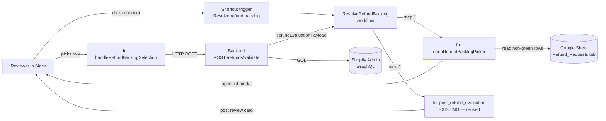
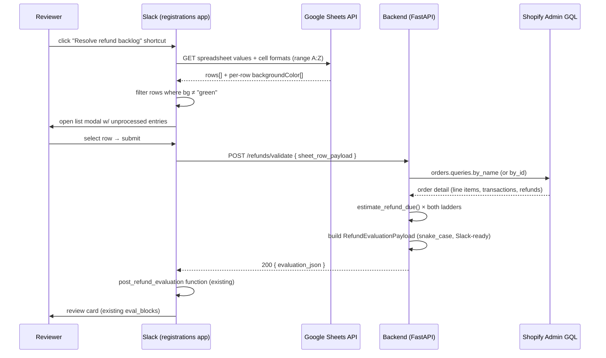
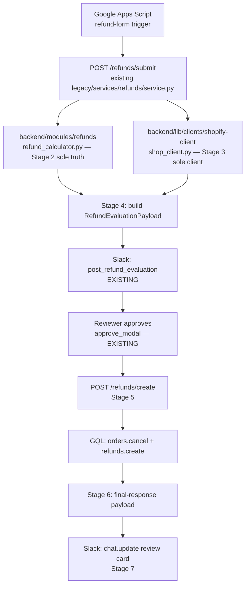

# Design Document: Refunds & Cancellations Workflow

## Overview

This feature ships a Slack-driven, multi-stage workflow that resolves waitlist
registration orders that need a refund, a cancellation, or both. The flow is
split into two execution paths that share a backend pipeline:

- **Path A — Stage 1 (Slack handling for the existing sheet backlog)** —
  reviewers trigger the workflow from Slack, the app reads the _current_
  refund-request Google Sheet, filters to unprocessed (non-green) rows, opens
  a list modal so the reviewer picks which entry to resolve, then reuses the
  existing refund **approve modal** (`views/refund/approve_modal.ts`) to drive
  the backend `POST /refunds/validate` call.
- **Path B — Stages 2–7 (full GAS-driven workflow)** — new entries flow in
  from the Google Apps Script trigger; the backend consolidates refund-estimate
  math, runs Shopify GraphQL operations through `backend/lib/clients/`, and
  produces Slack-block-ready payloads so the Slack side stays "dumb" (no
  reshaping). The reviewer approves through the same modal, and the backend
  performs cancel + refund as Shopify GQL calls before sending a final
  Slack-block-ready confirmation payload.

The user explicitly required:

- No reformatting of the Google Sheet — the backend adapts to whatever shape
  exists.
- Maximum reuse of the existing Slack views (`approve_modal`, `eval_blocks`,
  `list_modal` framework) and the existing backend refund estimate code.
- Backend produces Block-Kit-ready payloads; Slack only renders, never
  reshapes.
- Stage 2 consolidation is acceptable provided no name conflicts surface
  with Stage 1.
- Only the **approve** path is in scope for Stage 5 — no deny / dispute logic.
- Property-based testing is **not** used; example-based tests only.

### Investigation snapshot (file paths cited so the user can audit)

Refund-estimate math implementations found:

| File                                                      | Status                       | Notes                                                                                                                                                                  |
| --------------------------------------------------------- | ---------------------------- | ---------------------------------------------------------------------------------------------------------------------------------------------------------------------- |
| `backend/modules/refunds/refund_calculator.py`            | **Canonical / consolidated** | Pure math, all helpers, `EstimateTierKind` enum, `RefundResult.no_payment_made()` branch, mathematical-pseudocode-grade docstring referencing the prior three sources. |
| `backend/legacy/registrations/utils/refund_calculator.py` | Older near-duplicate         | Same shape but missing `no_payment_made` and richer date-token regex.                                                                                                  |
| `backend/modules/refunds/calculate_refund_due.py`         | Stub (commented)             | Type signature only; body is commented out. Slated for deletion in Stage 2.                                                                                            |
| `backend/modules/refunds/app/calculate_refund_due.py`     | Stub (commented)             | Identical content to above; duplicate path. Slated for deletion in Stage 2.                                                                                            |

Refund-orchestration / Shopify-call implementations found:

| File                                                             | Role                                                                                                                                                          |
| ---------------------------------------------------------------- | ------------------------------------------------------------------------------------------------------------------------------------------------------------- |
| `backend/legacy/registrations/services/refunds_service.py`       | `RefundsService` calling the _old_ `clients.shopify.shopify_client` (legacy `shopify_client/client.py`).                                                      |
| `backend/legacy/registrations/controllers/refunds_controller.py` | `validate_order_refund_eligibility` + `request_refund` + `create_refund` controller methods built around the legacy service.                                  |
| `backend/legacy/services/refunds/service.py`                     | Newer GQL client invocations (`schema.orders.mutations.cancel`, `schema.refunds.mutations.create`) using `backend/lib/clients/shopify-client/shop_client.py`. |
| `backend/legacy/services/refunds/evaluation.py`                  | Slack-payload builders (`build_found_payload`, `build_not_found_payload`, `build_parse_error_payload`). Stage 4/6 will keep these.                            |
| `aws/lambda/functions/RefundsAPI/`                               | Existing AWS Lambda doing the Shopify cancel/refund mutation. To be replaced by the consolidated backend Stage 3 implementation.                              |

Shopify GQL client (canonical for Stages 3 / 5):

- `backend/lib/clients/shopify-client/shop_client.py` exposes `ShopifyClient.run(op, **kwargs)` over a typed `schema` registry: `schema.orders.queries.by_id`, `schema.orders.mutations.cancel`, `schema.refunds.mutations.create`, `schema.orders.queries.by_name`.
- The older `backend/lib/clients/shopify_client/client.py` (with `ShopifyClient.send_request`) is **not** the one we will use; existing `legacy/services/refunds/service.py` already uses the newer registry.

Slack-side reuse anchors (existing code, untouched by this design unless noted):

- `slack-apps/registrations/views/refund/approve_modal.ts` — the **modal we reuse verbatim** for Stage 1.
- `slack-apps/registrations/views/refund/eval_blocks.ts` — the review-card builder; Stage 4 emits a payload it can already render unchanged.
- `slack-apps/registrations/domain/refund/orchestrator.ts` — modal handlers (`handleApproveButton`, `handleApproveModalBlockAction`, `handleApproveModalSubmit`).
- `slack-apps/registrations/domain/refund/types.ts` — `RefundEvaluationPayload` is the wire contract every backend → Slack response targets.
- `slack-apps/registrations/shared/google/client.ts` — `GoogleClient.getSpreadsheet()` is **values only**; cell-color reads are added to it (or as a sibling method `getCellFormats`) in Stage 1b.
- `slack-apps/registrations/shared/slack/list_modal.ts` — generic paginated list modal we reuse for the unprocessed-entry picker.
- `slack-apps/registrations/triggers/get_shopify_orders_trigger.ts` — the precedent for a Shortcut/link trigger; Stage 1's new trigger follows this pattern exactly.

Backend route shells already in place (`backend/routes.py`):

- `POST /refunds/validate` (currently a 204 stub) — Stage 1 wires this end-to-end.
- `POST /refunds/create` (currently a 204 stub) — Stage 5 wires this.
- `DELETE /orders/cancel` and `POST /refunds/approve` exist as 204 stubs; no work in this spec touches them directly.

---

## Architecture

### Stage 1 (Path A) — high-level system view



### Stage 1 (Path A) — sequence (Slack → backend → Shopify → Slack)



### Path B (Stages 2–7) — high-level



### Module / file map (per stage)

| Stage | Slack-app paths                                                                                                                                                                                                                                                                                                                      | Backend paths                                                                                                                                                                                                                                                                                      | Notes                                                                                                                         |
| ----- | ------------------------------------------------------------------------------------------------------------------------------------------------------------------------------------------------------------------------------------------------------------------------------------------------------------------------------------ | -------------------------------------------------------------------------------------------------------------------------------------------------------------------------------------------------------------------------------------------------------------------------------------------------- | ----------------------------------------------------------------------------------------------------------------------------- |
| 1     | `slack-apps/registrations/triggers/resolve_refund_backlog.ts` (new), `workflows/resolve_refund_backlog.ts` (new), `functions/open_refund_backlog_picker.ts` (new), `functions/handle_refund_backlog_selection.ts` (new), `domain/refund/backlog.ts` (new), `views/refund/backlog_modal.ts` (new), `shared/google/client.ts` (extend) | `backend/controllers/api/refunds_controller.py` (new), `backend/modules/refunds/services/validate_service.py` (new)                                                                                                                                                                                | Reuses `views/refund/approve_modal.ts` and `domain/refund/orchestrator.ts` unchanged.                                         |
| 2     | —                                                                                                                                                                                                                                                                                                                                    | `backend/modules/refunds/refund_calculator.py` (existing canonical), `backend/utils/datetime/`, `backend/utils/dict_utils/` (extract), delete `backend/modules/refunds/calculate_refund_due.py` + `backend/modules/refunds/app/`, delete `backend/legacy/registrations/utils/refund_calculator.py` | Pure consolidation.                                                                                                           |
| 3     | —                                                                                                                                                                                                                                                                                                                                    | `backend/modules/refunds/services/shopify_refund_service.py` (new), `backend/lib/clients/shopify-client/shop_client.py` (existing canonical)                                                                                                                                                       | Replaces `legacy/registrations/services/refunds_service.py`'s `refund_shopify_order` + the AWS Lambda cancel/refund mutation. |
| 4     | —                                                                                                                                                                                                                                                                                                                                    | `backend/modules/refunds/services/eval_payload_builder.py` (new home for the existing `legacy/services/refunds/evaluation.py` builders)                                                                                                                                                            | Slack-ready payload, no reshape on the Slack side.                                                                            |
| 5     | `slack-apps/registrations/domain/refund/orchestrator.ts` (existing — already routes to backend when `BARS_API_URL` is set)                                                                                                                                                                                                           | `backend/modules/refunds/services/execute_service.py` (new)                                                                                                                                                                                                                                        | Wires `POST /refunds/create` to `shopify_refund_service` from Stage 3.                                                        |
| 6     | —                                                                                                                                                                                                                                                                                                                                    | `eval_payload_builder.py` (Stage 4) reused with a `final_response=True` shape                                                                                                                                                                                                                      | Same Slack-ready philosophy applied to the post-execution card.                                                               |
| 7     | `slack-apps/registrations/domain/refund/orchestrator.ts` (existing — `chat.update` after `executeActionRequest`)                                                                                                                                                                                                                     | —                                                                                                                                                                                                                                                                                                  | Confirm no reshape happens; if it does, refactor it out.                                                                      |

### Parallelization plan (cross-cutting requirement)

Stage dependencies (→ = "must finish before"):

```
Stage 2 ─┐
         ├→ Stage 3 ─┐
Stage 1 ─┘           ├→ Stage 5 → Stage 6 → Stage 7
         Stage 4 ────┘
```

Confirmed parallelization opportunities:

- **Stage 1 ‖ Stage 2.** Stage 1 calls `POST /refunds/validate`, which under the
  hood needs the consolidated estimator (Stage 2). But Stage 2 is _consolidation
  only_ — the canonical implementation already exists at
  `backend/modules/refunds/refund_calculator.py`. Stage 1 imports from this
  module and works today; Stage 2 cleans up the duplicates without changing
  the import path. → **safe to run Stages 1 and 2 in parallel sub-agents.**
- **Stage 3 ‖ Stage 4** after Stage 2 lands. Both depend on the shared estimator
  module path (`backend/modules/refunds/refund_calculator.py`) but otherwise
  edit disjoint files (`shopify_refund_service.py` vs `eval_payload_builder.py`).
- **Stages 5 → 6 → 7 are sequential.** Stage 5 produces the final-execution
  result that Stage 6 shapes; Stage 7 only renders the Stage 6 payload.

Name-conflict risks identified (Stage 2 consolidation vs. Stage 1):

- Stage 1's new service is named `validate_service` and lives under
  `backend/modules/refunds/services/`. Stage 2 deletes
  `backend/modules/refunds/calculate_refund_due.py` and
  `backend/modules/refunds/app/calculate_refund_due.py` — neither name clashes.
- Stage 2 deletes `backend/legacy/registrations/utils/refund_calculator.py`.
  The legacy `RefundsService` at
  `backend/legacy/registrations/services/refunds_service.py` imports from this
  path; **if Stage 2 lands first while Stage 1 is mid-flight, the legacy
  service will break.** Mitigation: Stage 2 must update the legacy service's
  import to `backend.modules.refunds.refund_calculator` _before_ deleting the
  legacy duplicate, or both stages must coordinate via a feature flag. Documented
  as a hard handoff condition in §"Stage 2 — Acceptance Criteria" below.
- No symbol-name clashes between `validate_service.py` (Stage 1),
  `shopify_refund_service.py` (Stage 3), `eval_payload_builder.py` (Stage 4),
  and `execute_service.py` (Stage 5). All four are new files; none import each
  other's private symbols.

---

## Stage 1 — Slack handling for the existing sheet backlog

### Decision: Shortcut (link) trigger over slash command

The user's clarifications said "no preference, pick easiest given the existing
manifest patterns." The existing app already has a working Shortcut trigger
(`triggers/get_shopify_orders_trigger.ts` for the orders-export workflow) that
follows the exact pattern Stage 1 needs:

- Manifest already has the `commands` bot scope.
- `TriggerTypes.Shortcut` lets a reviewer click a link or invoke from any
  channel; the trigger forwards `interactivity` and `channel_id` straight into
  the workflow's input parameters.
- Slash commands in the Deno-Slack runtime require a separate Slash Commands
  feature definition and admin-side install flow, which we don't currently
  have wired.
- Shortcut triggers also let us iterate the trigger's display copy
  (`name` / `description`) without touching the deployed manifest.

→ **Stage 1 ships a Shortcut/link trigger** named "Resolve refund backlog".

### Stage 1a — Slack trigger, workflow, and the picker function

#### Files to add

```
slack-apps/registrations/
  triggers/resolve_refund_backlog.ts                  (new)
  workflows/resolve_refund_backlog.ts                 (new)
  functions/open_refund_backlog_picker.ts             (new)
  functions/handle_refund_backlog_selection.ts        (new)
  domain/refund/backlog.ts                            (new — pure logic)
  views/refund/backlog_modal.ts                       (new — reuses shared/list_modal)
  manifest.ts                                         (edit: register workflow)
```

#### Manifest edit

```typescript
// slack-apps/registrations/manifest.ts
import ResolveRefundBacklogWorkflow from "./workflows/resolve_refund_backlog.ts";

export default Manifest({
  // ...existing fields unchanged...
  workflows: [
    ProcessWaitlistSignupsWorkflow,
    ReceiveWaitlistOrderWorkflow,
    GetShopifyOrdersWorkflow,
    DryRunWaitlistWorkflow,
    EvaluateRefundRequestWorkflow,
    ResolveRefundBacklogWorkflow, // ← added
  ],
  // outgoingDomains already includes the BARS API host; no change needed.
  botScopes: ["commands", "chat:write", "chat:write.public"], // unchanged
});
```

#### Trigger definition (mirrors `get_shopify_orders_trigger.ts`)

```typescript
// slack-apps/registrations/triggers/resolve_refund_backlog.ts
import type { Trigger } from "deno-slack-sdk/types.ts";
import { TriggerContextData, TriggerTypes } from "deno-slack-api/mod.ts";
import ResolveRefundBacklogWorkflow from "../workflows/resolve_refund_backlog.ts";

const trigger: Trigger<typeof ResolveRefundBacklogWorkflow.definition> = {
  type: TriggerTypes.Shortcut,
  name: "Resolve refund backlog",
  description: "Pick an unprocessed refund-request row and run validation",
  workflow: `#/workflows/${ResolveRefundBacklogWorkflow.definition.callback_id}`,
  inputs: {
    interactivity: { value: TriggerContextData.Shortcut.interactivity },
    channel_id: { value: TriggerContextData.Shortcut.channel_id },
    user_id: { value: TriggerContextData.Shortcut.user_id },
  },
};

export default trigger;
```

#### Workflow

```typescript
// slack-apps/registrations/workflows/resolve_refund_backlog.ts
import { DefineWorkflow, Schema } from "deno-slack-sdk/mod.ts";
import { OpenRefundBacklogPickerFunction } from "../functions/open_refund_backlog_picker.ts";
import { HandleRefundBacklogSelectionFunction } from "../functions/handle_refund_backlog_selection.ts";
import { PostRefundEvaluationFunction } from "../functions/post_refund_evaluation.ts";

const ResolveRefundBacklogWorkflow = DefineWorkflow({
  callback_id: "resolve_refund_backlog",
  title: "Resolve refund backlog",
  input_parameters: {
    properties: {
      interactivity: { type: Schema.slack.types.interactivity },
      channel_id: { type: Schema.slack.types.channel_id },
      user_id: { type: Schema.slack.types.user_id },
    },
    required: ["interactivity"],
  },
});

// Step 1 — modal picker. Outputs the row the reviewer chose.
const step1 = ResolveRefundBacklogWorkflow.addStep(
  OpenRefundBacklogPickerFunction,
  {
    interactivity: ResolveRefundBacklogWorkflow.inputs.interactivity,
    channel_id: ResolveRefundBacklogWorkflow.inputs.channel_id,
  },
);

// Step 2 — POST the chosen row to the backend; outputs evaluation_json.
const step2 = ResolveRefundBacklogWorkflow.addStep(
  HandleRefundBacklogSelectionFunction,
  {
    selected_row_json: step1.outputs.selected_row_json,
  },
);

// Step 3 — reuse the existing review-card poster verbatim.
ResolveRefundBacklogWorkflow.addStep(PostRefundEvaluationFunction, {
  evaluation_json: step2.outputs.evaluation_json,
});

export default ResolveRefundBacklogWorkflow;
```

The third step is the **existing** `PostRefundEvaluationFunction`. The whole
review-card / approve / modal lifecycle is reused unchanged. Stage 1 owns
_only_ steps 1 and 2.

### Stage 1b — Reading non-green rows from the sheet, opening the list modal

#### The detection rule

The user wants only rows whose row background is **not green**. Reviewers
manually highlight a row green once they finish processing it; that's the
existing manual convention we must respect.

Google Sheets returns per-row format data via `spreadsheets.get` with a `fields`
mask:

```
GET https://sheets.googleapis.com/v4/spreadsheets/{spreadsheetId}
    ?ranges='{tabName}'!A1:Z
    &fields=sheets.data.rowData.values.effectiveFormat.backgroundColor,
            sheets.data.rowData.values.formattedValue
```

Response shape (truncated):

```json
{
  "sheets": [{
    "data": [{
      "rowData": [
        { "values": [
            { "formattedValue": "Header", "effectiveFormat": { "backgroundColor": {"red":1,"green":1,"blue":1} } },
            …
        ]},
        { "values": [
            { "formattedValue": "alice@…", "effectiveFormat": { "backgroundColor": {"red":0.78,"green":0.91,"blue":0.78} } },
            …
        ]}
      ]
    }]
  }]
}
```

`backgroundColor` is sRGB in `[0, 1]` floats. Empty / "no fill" comes back as
either `{red:1,green:1,blue:1}` (white) or absent. A row is **green** when:

```
isGreenBackground(rgb):
    return rgb is defined
       and rgb.green >= 0.55
       and rgb.green > rgb.red + 0.10
       and rgb.green > rgb.blue + 0.10
```

The threshold/tolerance is intentionally loose so any of Sheets' built-in
greens — light green 1, light green 2, light green 3 — match while pure
white, gray, yellow, and red do not. We pick the _first_ column's
backgroundColor as the row's color (per the user's "highlighted green" usage),
falling back to scanning the first three populated columns if the first cell
has no fill.

#### Extending the Slack-side Google client

`shared/google/client.ts` currently only exposes `getSpreadsheet()` (values
only). We add a sibling method that fetches both values _and_ per-cell
backgroundColor in a single call:

```typescript
// shared/google/client.ts (additions)

export interface CellWithFormat {
  value: string;
  /** sRGB 0..1; undefined when no fill is set on the cell. */
  backgroundColor?: { red: number; green: number; blue: number };
}

export interface SheetWithFormats {
  url: string;
  /** rowIndex 0 = header. Each row is a flat array of CellWithFormat. */
  rows: CellWithFormat[][];
}

export class GoogleClient {
  /* ...existing methods unchanged... */

  /** Read a tab's values **and** per-cell backgroundColor in a single
   *  `spreadsheets.get` call. Used by the refund-backlog picker to
   *  exclude rows the reviewer already highlighted green. */
  async getSpreadsheetWithFormats(
    spreadsheetId: string,
    tab: SheetTab,
    a1Range: string,
  ): Promise<SheetWithFormats> {
    const url =
      `${SHEETS_BASE}/${spreadsheetId}` +
      `?ranges=${encodeURIComponent(`'${tab.name}'!${a1Range}`)}` +
      `&fields=sheets.data.rowData.values.effectiveFormat.backgroundColor,` +
      `sheets.data.rowData.values.formattedValue`;
    const headers = await this.getRequestHeaders();
    const res = await fetch(url, { headers });
    if (!res.ok) {
      throw new Error(
        `Sheets GET formats failed (${res.status}): ${await res.text()}`,
      );
    }
    const data = await res.json();
    const rowData = data?.sheets?.[0]?.data?.[0]?.rowData ?? [];
    const rows: CellWithFormat[][] = rowData.map((r: { values?: unknown[] }) =>
      (r.values ?? []).map((cell): CellWithFormat => {
        const c = cell as {
          formattedValue?: string;
          effectiveFormat?: {
            backgroundColor?: { red?: number; green?: number; blue?: number };
          };
        };
        const bg = c.effectiveFormat?.backgroundColor;
        return {
          value: c.formattedValue ?? "",
          backgroundColor: bg
            ? { red: bg.red ?? 0, green: bg.green ?? 0, blue: bg.blue ?? 0 }
            : undefined,
        };
      }),
    );
    return {
      url: `https://docs.google.com/spreadsheets/d/${spreadsheetId}/edit?gid=${tab.id}#gid=${tab.id}`,
      rows,
    };
  }
}
```

#### Domain logic — `domain/refund/backlog.ts`

Pure functions, no I/O. Backend adapts to whatever shape the sheet has, so the
parser is **column-name driven**: it reads the header row and locates the
columns it needs by case-insensitive label match. The user said the existing
sheet structure is _not_ to be reformatted; this is how we honor that
constraint.

```typescript
// slack-apps/registrations/domain/refund/backlog.ts

import type {
  CellWithFormat,
  SheetWithFormats,
} from "../../shared/google/client.ts";

/** Per-row payload the picker hands to the backend. Mirrors the sheet
 *  columns we know about today; unknown columns are passed through under
 *  `extras` so backend-side adapters can use them without a Slack redeploy. */
export interface BacklogEntry {
  rowNumber: number; // 1-based, matches the sheet's row number
  submittedAt?: string;
  email?: string;
  firstName?: string;
  lastName?: string;
  orderNumber?: string; // e.g. "#48957" or "48957"
  orderId?: string; // Shopify GID if the sheet has one
  refundTo?: string; // "store_credit" | "original_method" | free text
  notes?: string;
  /** Every column the parser doesn't recognize, keyed by header text. */
  extras: Record<string, string>;
}

const HEADER_ALIASES: Record<
  keyof Omit<BacklogEntry, "rowNumber" | "extras">,
  string[]
> = {
  submittedAt: ["submitted at", "timestamp", "request submitted at"],
  email: ["email", "email address"],
  firstName: ["first name", "firstname"],
  lastName: ["last name", "lastname"],
  orderNumber: ["order number", "order #", "order"],
  orderId: ["order id", "shopify order id"],
  refundTo: ["refund to", "refund method", "preferred refund"],
  notes: ["notes", "reason", "comment"],
};

function norm(s: string): string {
  return s.trim().toLowerCase();
}

/** Map header label → column index (0-based). Unknown headers are recorded so
 *  we can still surface them via `extras`. */
export function buildColumnIndex(header: CellWithFormat[]): {
  known: Partial<Record<keyof BacklogEntry, number>>;
  unknown: Record<string, number>;
} {
  const known: Partial<Record<keyof BacklogEntry, number>> = {};
  const unknown: Record<string, number> = {};

  header.forEach((cell, idx) => {
    const label = norm(cell.value);
    if (!label) return;
    let matched = false;
    for (const [field, aliases] of Object.entries(HEADER_ALIASES)) {
      if (aliases.includes(label)) {
        known[field as keyof BacklogEntry] = idx;
        matched = true;
        break;
      }
    }
    if (!matched) unknown[cell.value.trim()] = idx;
  });

  return { known, unknown };
}

/** Loose-tolerance "this row is highlighted green" predicate — matches
 *  Sheets' built-in greens but rejects white / gray / yellow / red. */
export function isGreenBackground(
  bg: { red: number; green: number; blue: number } | undefined,
): boolean {
  if (!bg) return false;
  return (
    bg.green >= 0.55 && bg.green > bg.red + 0.1 && bg.green > bg.blue + 0.1
  );
}

/** A row is "processed" when ANY of the first three populated cells is
 *  highlighted green. Reviewers sometimes only highlight the row identifier
 *  cell, sometimes the whole row — checking the first few non-empty cells
 *  catches both. */
export function isRowProcessed(row: CellWithFormat[]): boolean {
  let inspected = 0;
  for (const cell of row) {
    if (cell.value.trim() === "" && cell.backgroundColor === undefined)
      continue;
    if (isGreenBackground(cell.backgroundColor)) return true;
    inspected += 1;
    if (inspected >= 3) break;
  }
  return false;
}

export function parseBacklogRow(
  row: CellWithFormat[],
  rowIndex: number,
  cols: ReturnType<typeof buildColumnIndex>,
): BacklogEntry {
  const at = (col: number | undefined): string | undefined =>
    col === undefined ? undefined : row[col]?.value?.trim() || undefined;

  const extras: Record<string, string> = {};
  for (const [label, idx] of Object.entries(cols.unknown)) {
    const v = row[idx]?.value?.trim();
    if (v) extras[label] = v;
  }

  return {
    rowNumber: rowIndex + 1, // header is row 1; first data row is 2
    submittedAt: at(cols.known.submittedAt),
    email: at(cols.known.email),
    firstName: at(cols.known.firstName),
    lastName: at(cols.known.lastName),
    orderNumber: at(cols.known.orderNumber),
    orderId: at(cols.known.orderId),
    refundTo: at(cols.known.refundTo),
    notes: at(cols.known.notes),
    extras,
  };
}

export function buildUnprocessedBacklog(
  sheet: SheetWithFormats,
): BacklogEntry[] {
  if (sheet.rows.length === 0) return [];
  const [header, ...dataRows] = sheet.rows;
  const cols = buildColumnIndex(header);
  return dataRows
    .map((row, idx) => ({ row, idx: idx + 1 })) // +1 because header was popped
    .filter(({ row }) => !isRowProcessed(row))
    .filter(({ row }) => row.some((cell) => cell.value.trim() !== ""))
    .map(({ row, idx }) => parseBacklogRow(row, idx, cols));
}
```

#### View — `views/refund/backlog_modal.ts`

Reuses the generic `shared/slack/list_modal.ts` framework (already proven by
the waitlist list modal). One row per backlog entry; per-row dropdown is
binary ("Resolve" / "Skip"). On submit, the function reads the selected entry
out of `private_metadata` and forwards it to step 2.

```typescript
// slack-apps/registrations/views/refund/backlog_modal.ts

import { buildListModal } from "../../shared/slack/list_modal.ts";
import type { SlackView } from "../../shared/slack/message.ts";
import type { BacklogEntry } from "../../domain/refund/backlog.ts";

export const CALLBACK_ID = "refund_backlog_picker";
export const ACTION_PREFIX = "pick_r";
export const RESOLVE_VALUE = "resolve";

const ACTION_OPTIONS = [
  { label: "Skip", value: "skip" },
  { label: "Resolve this row", value: RESOLVE_VALUE },
];

export interface BacklogModalState {
  /** Channel where the shortcut was triggered — passed through to the
   *  approve modal's existing meta. */
  ch: string;
  /** Selected row number from the sheet. */
  pick?: number;
  /** Pagination offset into the entries list. */
  off?: number;
}

function entryTitle(e: BacklogEntry): string {
  const who =
    [e.firstName, e.lastName].filter(Boolean).join(" ") ||
    e.email ||
    `Row ${e.rowNumber}`;
  const order = e.orderNumber ? ` · ${e.orderNumber}` : "";
  return `*${who}*${order}`;
}

function entryContext(e: BacklogEntry): string[] {
  const lines: string[] = [];
  if (e.email) lines.push(`✉️ ${e.email}`);
  if (e.refundTo) lines.push(`Refund to: ${e.refundTo}`);
  if (e.submittedAt) lines.push(`Submitted: ${e.submittedAt}`);
  if (e.notes) lines.push(`Notes: ${e.notes.slice(0, 140)}`);
  return lines;
}

export function buildBacklogModal(args: {
  entries: BacklogEntry[];
  sheetUrl: string;
  state: BacklogModalState;
}): SlackView {
  return buildListModal<BacklogEntry>({
    callbackId: CALLBACK_ID,
    title: "Resolve refund backlog",
    submitLabel: "Continue",
    closeLabel: "Cancel",
    headerText: `${args.entries.length} unprocessed refund request${args.entries.length === 1 ? "" : "s"}`,
    subText: `<${args.sheetUrl}|Open the refund-request sheet>`,
    instructionText:
      "Pick a row to resolve. Resolving runs eligibility validation against Shopify and posts a review card with refund estimates. Rows already highlighted green in the sheet are excluded from this list.",
    items: args.entries,
    offset: args.state.off ?? 0,
    pageSize: 5,
    formatItemTitle: entryTitle,
    formatItemContextLines: entryContext,
    getItemId: (e) => e.rowNumber,
    getBlockId: (e) => `entry_r${e.rowNumber}`,
    getActionId: (e) => `${ACTION_PREFIX}${e.rowNumber}`,
    actionOptions: ACTION_OPTIONS,
    paginationActionIds: { prev: "prev_page", next: "next_page" },
    existingSelections:
      args.state.pick !== undefined
        ? { [String(args.state.pick)]: RESOLVE_VALUE }
        : undefined,
    metadata: JSON.stringify(args.state),
    emptyMessage:
      "No unprocessed refund requests. Either every row is highlighted green or the sheet is empty.",
  });
}
```

#### Function — `functions/open_refund_backlog_picker.ts`

```typescript
// slack-apps/registrations/functions/open_refund_backlog_picker.ts

import { DefineFunction, Schema, SlackFunction } from "deno-slack-sdk/mod.ts";
import { getOrCreateGoogleClient } from "../shared/google/client.ts";
import { WORKFLOWS } from "../config/workflows.ts";
import {
  buildUnprocessedBacklog,
  type BacklogEntry,
} from "../domain/refund/backlog.ts";
import {
  buildBacklogModal,
  CALLBACK_ID,
  ACTION_PREFIX,
} from "../views/refund/backlog_modal.ts";
import { executionId } from "../shared/slack/workflow.ts";

const SHEET = WORKFLOWS.refund.sheet;
const SHEET_TAB = { name: SHEET.tab_name, id: SHEET.tab_id };

export const OpenRefundBacklogPickerFunction = DefineFunction({
  callback_id: "open_refund_backlog_picker",
  title: "Open refund backlog picker",
  source_file: "functions/open_refund_backlog_picker.ts",
  input_parameters: {
    properties: {
      interactivity: { type: Schema.slack.types.interactivity },
      channel_id: { type: Schema.slack.types.channel_id },
    },
    required: ["interactivity", "channel_id"],
  },
  output_parameters: {
    properties: {
      selected_row_json: { type: Schema.types.string },
    },
    required: ["selected_row_json"],
  },
});

const handler = SlackFunction(
  OpenRefundBacklogPickerFunction,
  async ({ inputs, env, client }) => {
    const google = getOrCreateGoogleClient(env);
    const sheet = await google.getSpreadsheetWithFormats(
      SHEET.spreadsheet_id,
      SHEET_TAB,
      "A1:Z",
    );
    const entries = buildUnprocessedBacklog(sheet);

    const openRes = await client.views.open({
      interactivity_pointer: inputs.interactivity.interactivity_pointer,
      view: buildBacklogModal({
        entries,
        sheetUrl: sheet.url,
        state: { ch: inputs.channel_id },
      }),
    });
    if (!openRes.ok) return { error: `Failed to open modal: ${openRes.error}` };
    return { completed: false };
  },
);

// Per-row dropdown selection updates state in private_metadata.
handler.addBlockActionsHandler(
  new RegExp(`^${ACTION_PREFIX}\\d+$`),
  async ({ action, body, client, env }) => {
    const state = JSON.parse(body.view?.private_metadata || "{}");
    const rowNumber = Number(action.action_id.slice(ACTION_PREFIX.length));
    state.pick =
      action.selected_option?.value === "resolve" ? rowNumber : undefined;

    const google = getOrCreateGoogleClient(env);
    const sheet = await google.getSpreadsheetWithFormats(
      SHEET.spreadsheet_id,
      SHEET_TAB,
      "A1:Z",
    );
    const entries = buildUnprocessedBacklog(sheet);

    await client.views.update({
      view_id: body.view?.id,
      view: buildBacklogModal({ entries, sheetUrl: sheet.url, state }),
    });
  },
);

handler.addViewSubmissionHandler(
  CALLBACK_ID,
  async ({ body, view, client, env }) => {
    const state = JSON.parse(view.private_metadata || "{}") as {
      ch: string;
      pick?: number;
    };
    if (state.pick === undefined) {
      return {
        response_action: "errors",
        errors: { [`entry_r${1}`]: "Pick a row to resolve before continuing" },
      };
    }
    const google = getOrCreateGoogleClient(env);
    const sheet = await google.getSpreadsheetWithFormats(
      SHEET.spreadsheet_id,
      SHEET_TAB,
      "A1:Z",
    );
    const entries = buildUnprocessedBacklog(sheet);
    const chosen = entries.find((e) => e.rowNumber === state.pick);
    if (!chosen) {
      return {
        response_action: "errors",
        errors: {
          [`entry_r${state.pick}`]:
            "That row is no longer unprocessed — refresh and try again",
        },
      };
    }

    const execId = executionId(body);
    if (execId) {
      await client.functions.completeSuccess({
        function_execution_id: execId,
        outputs: {
          selected_row_json: JSON.stringify({ ...chosen, channel: state.ch }),
        },
      });
    }
  },
);

export default handler;
```

### Stage 1c — Backend call to `/refunds/validate` and the response shape

The Slack function `handle_refund_backlog_selection.ts` is the second workflow
step. It takes the backlog row, posts it to the backend, and forwards the
backend's response (a `RefundEvaluationPayload` JSON string) into the existing
`PostRefundEvaluationFunction`.

#### Slack function

```typescript
// slack-apps/registrations/functions/handle_refund_backlog_selection.ts

import { DefineFunction, Schema, SlackFunction } from "deno-slack-sdk/mod.ts";
import { barsApiBaseUrl } from "../config/store.ts";
import type { BacklogEntry } from "../domain/refund/backlog.ts";

export const HandleRefundBacklogSelectionFunction = DefineFunction({
  callback_id: "handle_refund_backlog_selection",
  title: "Validate refund backlog selection",
  source_file: "functions/handle_refund_backlog_selection.ts",
  input_parameters: {
    properties: {
      selected_row_json: { type: Schema.types.string },
    },
    required: ["selected_row_json"],
  },
  output_parameters: {
    properties: {
      evaluation_json: { type: Schema.types.string },
    },
    required: ["evaluation_json"],
  },
});

export default SlackFunction(
  HandleRefundBacklogSelectionFunction,
  async ({ inputs }) => {
    const base = barsApiBaseUrl();
    if (!base) return { error: "BARS_API_URL is not set" };

    const row = JSON.parse(inputs.selected_row_json) as BacklogEntry & {
      channel: string;
    };
    const res = await fetch(`${base}/refunds/validate`, {
      method: "POST",
      headers: { "Content-Type": "application/json" },
      body: JSON.stringify({
        row_number: row.rowNumber,
        email: row.email,
        first_name: row.firstName,
        last_name: row.lastName,
        order_number: row.orderNumber,
        order_id: row.orderId,
        refund_to: row.refundTo,
        notes: row.notes,
        submitted_at: row.submittedAt,
        extras: row.extras,
      }),
    });
    if (!res.ok) {
      return {
        error: `Backend /refunds/validate returned ${res.status}: ${await res.text()}`,
      };
    }
    const payload = await res.json();
    return { outputs: { evaluation_json: JSON.stringify(payload) } };
  },
);
```

#### Backend route + controller + service

`backend/routes.py` already declares the route stub:

```python
# backend/routes.py (existing)
@refunds.post("/validate")
async def validate_refund_request():
    return Response(status_code=204)
```

We replace the body with a controller delegation:

```python
# backend/routes.py (edit)
from controllers.api.refunds_controller import RefundsApiController
from modules.refunds.models.validate_request import RefundValidateRequest

_refunds_api = RefundsApiController()

@refunds.post("/validate")
async def validate_refund_request(body: RefundValidateRequest):
    return await _refunds_api.validate(body)
```

New controller:

```python
# backend/controllers/api/refunds_controller.py (new)
from fastapi.responses import JSONResponse

from modules.refunds.models.validate_request import RefundValidateRequest
from modules.refunds.services.validate_service import ValidateService

class RefundsApiController:
    def __init__(self) -> None:
        self.service = ValidateService()

    async def validate(self, body: RefundValidateRequest) -> JSONResponse:
        payload = await self.service.validate(body)
        return JSONResponse(status_code=200, content=payload)
```

Request model:

```python
# backend/modules/refunds/models/validate_request.py (new)
from datetime import datetime

from pydantic import BaseModel, EmailStr


class RefundValidateRequest(BaseModel):
    row_number: int
    email: EmailStr | None = None
    first_name: str | None = None
    last_name: str | None = None
    order_number: str | None = None
    order_id: str | None = None
    refund_to: str | None = None
    notes: str | None = None
    submitted_at: datetime | None = None
    extras: dict[str, str] = {}
```

Validate service — preconditions, postconditions, loop invariants:

```python
# backend/modules/refunds/services/validate_service.py (new)
"""Stage 1c: turn a backlog row into the Slack-ready RefundEvaluationPayload.

Preconditions
- ``body`` has at least one of {order_id, order_number}.
- ``backend.modules.refunds.refund_calculator.estimate_refund_due`` is the
  single source of truth for tier math (Stage 2 enforces this; Stage 1 simply
  imports from it today).

Postconditions
- Returns a snake_case dict matching the Slack `RefundEvaluationPayload` TS type.
- ``order_found`` ↔ Shopify returned an order.
- When ``order_found`` is true, ``estimated_refund_to_original`` and
  ``estimated_store_credit`` are populated unless season HTML is missing or
  unparsable (in which case ``warnings`` carries a descriptive entry).
"""

from __future__ import annotations

import os
from datetime import datetime, timezone
from typing import Any

from box import Box

from modules.refunds.models.validate_request import RefundValidateRequest
from modules.refunds.refund_calculator import (
    EstimateTierKind,
    SeasonDates,
    estimate_refund_due,
)
# Reused as-is from legacy/services/refunds; Stage 4 relocates these to
# modules/refunds/services/eval_payload_builder.py without changing semantics.
from legacy.services.refunds.evaluation import (
    build_found_payload,
    build_not_found_payload,
    build_parse_error_payload,
    order_refund_facts,
)
from legacy.services.refunds.matching import validate_against_order
from legacy.services.refunds.requests import RefundSubmitRequest
from shopify_client.shop_client import ShopifyClient, schema  # type: ignore[import-not-found]


_shopify = ShopifyClient(
    store_id=os.environ.get("SHOPIFY__STORE_ID", ""),
    api_version=os.environ.get("SHOPIFY__API_VERSION", "2026-07"),
    token=os.environ.get("SHOPIFY__TOKEN__ADMIN", ""),
)


class ValidateService:
    async def validate(self, body: RefundValidateRequest) -> dict[str, Any]:
        # Coerce backlog row into a RefundSubmitRequest so we can reuse the
        # existing payload builders verbatim. The slack_trigger_url field is
        # unused on this path (Slack receives the dict directly).
        submit = RefundSubmitRequest(
            number=_strip_hash(body.order_number) if body.order_number else None,
            id=body.order_id,
            email=body.email or "unknown@bigapplerecsports.com",
            first_name=body.first_name or "Unknown",
            last_name=body.last_name or "Unknown",
            refund_to=_normalize_refund_to(body.refund_to),
            notes=body.notes,
            submitted_at=body.submitted_at or datetime.now(timezone.utc),
            is_test=False,
        )

        order = _fetch_order(submit)
        if order is None:
            return build_not_found_payload(submit, error="order_not_found")

        validation = validate_against_order(
            order,
            email=str(submit.email),
            first_name=submit.first_name,
            last_name=submit.last_name,
        )

        _, _, refundable, _ = order_refund_facts(order)
        product_html = _product_html(order)

        if not product_html:
            return build_parse_error_payload(
                order, submit,
                validation=validation,
                note="Product description HTML missing — cannot derive season dates.",
            )

        season = SeasonDates.from_html(product_html)
        if not season.start_date:
            return build_parse_error_payload(
                order, submit,
                validation=validation,
                note="Season dates could not be parsed from product description.",
            )

        # Loop invariant: every iteration produces one RefundResult per ladder
        # against the same season + refundable + submitted_at; mutation-free.
        est_original = estimate_refund_due(
            season, refundable, EstimateTierKind.REFUND_TO_ORIGINAL,
            submitted_at=submit.submitted_at,
        )
        est_credit = estimate_refund_due(
            season, refundable, EstimateTierKind.STORE_CREDIT,
            submitted_at=submit.submitted_at,
        )
        return build_found_payload(
            order, submit,
            season=season,
            est_original=est_original,
            est_credit=est_credit,
            validation=validation,
        )


def _strip_hash(s: str) -> str:
    return s[1:] if s.startswith("#") else s


def _normalize_refund_to(raw: str | None) -> str:
    if not raw:
        return "store_credit"
    v = raw.strip().lower().replace(" ", "_")
    if v in ("original", "original_method", "original_payment"):
        return "original_method"
    return "store_credit"


def _fetch_order(submit: RefundSubmitRequest) -> Box | None:
    if submit.id:
        return _shopify.run(schema.orders.queries.by_id, id=submit.id)
    matches = _shopify.run(schema.orders.queries.by_name, name=f"#{submit.number}")
    if not matches:
        return None
    return _shopify.run(schema.orders.queries.by_id, id=matches[0].id)


def _product_html(order: Box) -> str | None:
    if not order.line_items or order.line_items[0].product is None:
        return None
    return order.line_items[0].product.description_html
```

#### Configurable target channel — `REFUND_NOTIFICATION_CHANNEL`

The user wants the **target Slack channel** for the review-card post to be
configurable via env var, defaulting to `#joe-test`.

The existing review-card poster (`PostRefundEvaluationFunction`) routes via
`getStaticChannels("refund")` defined in `slack-apps/registrations/config/workflows.ts`:

```typescript
refund: {
    channels: {
        source: "static",
        test: envOr("REFUND_TEST_CHANNEL", "#joe-test"),
        review: envOr("REFUND_REVIEW_CHANNEL", "#exec-leadership-2026"),
    },
}
```

We extend this slightly: a **third** channel slot used specifically for the
backlog flow. This avoids re-routing every other refund-eval post when an
operator overrides the backlog target.

```typescript
// slack-apps/registrations/config/workflows.ts (edit)
refund: {
    channels: {
        source: "static",
        test: envOr("REFUND_TEST_CHANNEL", "#joe-test"),
        review: envOr("REFUND_REVIEW_CHANNEL", "#exec-leadership-2026"),
        // ↓ added — used when posting backlog reviews; falls back to test channel.
        backlog: envOr("REFUND_NOTIFICATION_CHANNEL", envOr("REFUND_TEST_CHANNEL", "#joe-test")),
    },
}

// new helper used by post_refund_evaluation when payload.is_test === false but
// payload metadata flags this as a backlog flow.
export function getBacklogChannel(): string {
    const ch = WORKFLOWS.refund.channels;
    if (ch.source !== "static") throw new Error("refund channels not static");
    return ch.backlog;
}
```

The Slack function `handle_refund_backlog_selection.ts` adds a marker to the
payload (`is_backlog: true`) — the existing review-card orchestrator
(`runPostRefundEvaluation`) is patched once to honor the marker:

```typescript
// slack-apps/registrations/domain/refund/orchestrator.ts (one-line edit)
const channel = (payload as { is_backlog?: boolean }).is_backlog
  ? getBacklogChannel()
  : resolveChannel(REFUND_CHANNELS, { is_test: payload.is_test });
```

This is the _only_ edit to existing Slack code outside the new files Stage 1
adds. `is_backlog` is a tiny additive field on `RefundEvaluationPayload` and
is documented in the type alongside `is_test`.

#### Order ID metadata for the modal submit

The existing approve modal already carries `order_number` in
`RefundEvaluationPayload` and reads `payload.order_id` on submit
(`handleApproveModalSubmit`). Stage 1 inherits this verbatim — no extra plumbing
needed. The order id flows: backend `validate_service.py` → `evaluation.py`
builder → `evaluation_json` → `PostRefundEvaluationFunction` → modal
submit. The modal submit already POSTs `BARS_API_URL/refunds/create` when
`BARS_API_URL` is set (Stage 5 finishes the backend route).

### Stage 1 — acceptance criteria

1. Reviewer can click the "Resolve refund backlog" shortcut in any channel and
   the modal opens within Slack's 3-second `views.open` budget.
2. The modal displays only rows whose first non-empty cell is **not**
   highlighted green (per `isGreenBackground`). Rows highlighted green are
   excluded; rows with no fill are included.
3. Selecting a row, hitting Continue, and proceeding causes a
   `POST /refunds/validate` request whose body contains the row's
   `order_number` (or `order_id`), `email`, names, refund preference, and any
   unrecognized columns under `extras`.
4. The backend response is a `RefundEvaluationPayload`-shaped JSON dict (see
   `slack-apps/registrations/domain/refund/types.ts`); the existing
   `eval_blocks.ts` builder renders it without modification.
5. The review card posts to the channel resolved from
   `REFUND_NOTIFICATION_CHANNEL` (env var; default `#joe-test`).
6. The existing approve-modal flow (`handleApproveButton`,
   `handleApproveModalSubmit`) processes the card unchanged — including the
   modal carrying `order_id` back to the backend on submit.
7. Tests:
   - Unit: `domain/refund/backlog.ts` — `isGreenBackground` (5 cases),
     `buildColumnIndex` (alias coverage), `buildUnprocessedBacklog`
     (mixed-color sheet fixture), `parseBacklogRow` (extras passthrough).
   - Unit: `validate_service.py` — fake `ShopifyClient` returning a known
     order shape; assert payload matches the expected
     `RefundEvaluationPayload`-shaped dict; cover order-not-found,
     missing-product-html, unparsable-season, happy-path.
   - Integration: backend test that `POST /refunds/validate` returns a 200
     with the expected wire shape against a stubbed Shopify client.

### Stage 1 handoff readiness

- The orchestrator dispatching the Stage 1 execution sub-agent must have:
  - This Stage 1 section (1a/1b/1c) in context.
  - The list of files to add (above).
  - Read access to `slack-apps/registrations/views/refund/approve_modal.ts`,
    `views/refund/eval_blocks.ts`, `domain/refund/orchestrator.ts`,
    `shared/google/client.ts`, `config/workflows.ts`, `manifest.ts`.
  - Read access to `backend/routes.py`,
    `backend/modules/refunds/refund_calculator.py`,
    `backend/legacy/services/refunds/evaluation.py`,
    `backend/legacy/services/refunds/matching.py`,
    `backend/legacy/services/refunds/requests.py`,
    `backend/lib/clients/shopify-client/shop_client.py`.
- Stage 1 has **no hidden dependency on later stages**:
  - It imports `estimate_refund_due` from
    `backend/modules/refunds/refund_calculator.py` — the canonical
    implementation that already exists.
  - It reuses `legacy/services/refunds/evaluation.py` payload builders. Stage 4
    later relocates them but does not change behavior; Stage 1 will follow the
    relocation in a one-line import update and nothing more.
  - It calls Shopify via the same client/schema (`backend/lib/clients/shopify-client/shop_client.py`)
    that Stage 3 will consolidate around. Stage 3 doesn't change the public API
    of `schema.orders.queries.by_id` or `by_name`, so Stage 1 won't churn.

---

## Stage 2 — Backend refund-estimate consolidation

### Inventory of existing implementations (audit)

| Path                                                           | Status                                                                                                                                         | Action                                                                                                              |
| -------------------------------------------------------------- | ---------------------------------------------------------------------------------------------------------------------------------------------- | ------------------------------------------------------------------------------------------------------------------- |
| `backend/modules/refunds/refund_calculator.py`                 | **Canonical.** Pure pydantic + StrEnum, `EstimateTierKind`, `RefundResult.no_payment_made()`, dual-format date regex, off-week schedule shift. | Keep as the sole source of truth.                                                                                   |
| `backend/modules/refunds/calculate_refund_due.py`              | All-commented stub returning `{}`.                                                                                                             | **Delete.**                                                                                                         |
| `backend/modules/refunds/app/calculate_refund_due.py`          | All-commented stub returning `{}` (duplicate path).                                                                                            | **Delete the entire `app/` subpackage.**                                                                            |
| `backend/modules/refunds/app/main.py`                          | Trivial `RefundsService.process_initial_refund_request` wrapper with stale imports.                                                            | **Delete with `app/`.**                                                                                             |
| `backend/legacy/registrations/utils/refund_calculator.py`      | Older near-duplicate of canonical; missing `no_payment_made`, narrower regex (numeric dates only).                                             | **Delete after rewriting the one importer.**                                                                        |
| `backend/legacy/registrations/services/refunds_service.py`     | The only importer of the older calculator.                                                                                                     | **Edit:** point its imports at `backend.modules.refunds.refund_calculator`.                                         |
| `backend/legacy/services/refunds/service.py` + `evaluation.py` | Already imports from `lib.domain.registrations.refunds` — a third path that aliases the canonical module via the `lib` package.                | **Verify the alias** points at `backend/modules/refunds/refund_calculator.py`. If it points elsewhere, redirect it. |

### Pure-helper extraction to `backend/utils/`

Move the I/O-free helpers in `refund_calculator.py` that aren't refund-specific
into `backend/utils/`:

| From                       | To                                                                  | Rationale                                                                                            |
| -------------------------- | ------------------------------------------------------------------- | ---------------------------------------------------------------------------------------------------- |
| `add_days(dt, days)`       | `backend/utils/datetime/__init__.py`                                | One-liner; already lives in `utils/datetime/date_utils.py` per its filename — confirm and re-export. |
| `parse_date_mdy(date_str)` | `backend/utils/date_utils/parse_date.py` (file already exists)      | Slot into the `parse_date` family.                                                                   |
| `parse_csv_dates(csv)`     | `backend/utils/date_utils/parse_off_dates.py` (file already exists) | This file's name already implies the function.                                                       |
| `strip_html(html)`         | `backend/utils/text/strip_html.py` (new)                            | Generic utility.                                                                                     |
| `ensure_utc(dt)`           | `backend/utils/datetime/ensure_utc.py` (new)                        | Generic utility.                                                                                     |

The estimator imports them back. Keep `parse_season_date`, the date-token
regex, `_norm_date`, the tier ladders, `WeekSchedule`, `SeasonDates`,
`RefundResult`, `EstimateTierKind`, and `estimate_refund_due` in the estimator —
those are refund domain.

### Target module layout (post-consolidation)

```
backend/
  modules/
    refunds/
      __init__.py
      refund_calculator.py          # tier math, SeasonDates, RefundResult — canonical
      models/
        refund_request.py           # existing
        validate_request.py         # added by Stage 1
      services/
        validate_service.py         # added by Stage 1
        eval_payload_builder.py     # added by Stage 4 (replaces legacy/services/refunds/evaluation.py)
        shopify_refund_service.py   # added by Stage 3
        execute_service.py          # added by Stage 5
  controllers/
    api/
      refunds_controller.py         # added by Stage 1
```

Files deleted by Stage 2:

```
backend/modules/refunds/calculate_refund_due.py
backend/modules/refunds/app/                                  (entire subpackage)
backend/legacy/registrations/utils/refund_calculator.py
```

### Function signatures (canonical estimator) — unchanged from today

```python
class EstimateTierKind(StrEnum):
    REFUND_TO_ORIGINAL = "original_method"
    STORE_CREDIT = "store_credit"

class SeasonDates(BaseModel):
    @classmethod
    def from_html(cls, html: str) -> "SeasonDates": ...
    def to_schedule(self) -> "WeekSchedule": ...
    @property
    def is_short(self) -> bool: ...

class WeekSchedule(BaseModel):
    @classmethod
    def build(cls, start: datetime, off_dates: list[datetime], num_weeks: int = 5) -> "WeekSchedule": ...
    def week_index(self, submitted_at: datetime) -> int: ...
    def resolve_tier(
        self, submitted_at: datetime, tiers: list[RefundTier], is_short_season: bool = False,
    ) -> tuple[RefundTier, int] | None: ...

class RefundResult(BaseModel):
    @property
    def message(self) -> str: ...
    @classmethod
    def zero(cls, timing: str = "") -> "RefundResult": ...
    @classmethod
    def no_payment_made(cls) -> "RefundResult": ...
    @classmethod
    def error(cls) -> "RefundResult": ...

def estimate_refund_due(
    season: SeasonDates,
    total_paid: float,
    tier_kind: EstimateTierKind,
    submitted_at: datetime | None = None,
) -> RefundResult: ...
```

### Name-conflict avoidance with Stage 1

- Stage 1 introduces `backend/modules/refunds/services/validate_service.py`.
  Stage 2 removes `backend/modules/refunds/calculate_refund_due.py` and
  `backend/modules/refunds/app/`. No path collision.
- Stage 1's `RefundsApiController` is in `backend/controllers/api/`. Stage 2
  doesn't touch controllers — no collision.
- The legacy `RefundsService` at
  `backend/legacy/registrations/services/refunds_service.py` is **not deleted**
  by Stage 2 — only its `from utils.refund_calculator import …` line is
  rewritten to `from modules.refunds.refund_calculator import …`. This avoids
  breaking any other legacy importers and is the gating step before deleting
  `backend/legacy/registrations/utils/refund_calculator.py`.
- Stage 2 must run its import-rewrite _before_ its delete. The execution
  sub-agent should treat the delete as the final commit of Stage 2.

### Stage 2 — acceptance criteria

1. Three duplicate calculators (`backend/modules/refunds/calculate_refund_due.py`,
   `backend/modules/refunds/app/calculate_refund_due.py`,
   `backend/legacy/registrations/utils/refund_calculator.py`) are deleted; only
   `backend/modules/refunds/refund_calculator.py` survives.
2. Every existing callsite of the deleted calculators imports the canonical
   path. `grep -r "from utils.refund_calculator"` and similar return zero hits.
3. Helpers extracted to `backend/utils/` are re-exported into
   `refund_calculator.py` so its public surface is unchanged.
4. All existing pytest suites under `backend/tests/modules/refunds/` and
   `backend/legacy/registrations/tests/` pass without modification.
5. No new behavior is introduced — Stage 2 is a structural cleanup.

---

## Stage 3 — Backend → Shopify request consolidation

### Existing places doing Shopify cancel/refund work

| Path                                                                             | What it calls                                                                                                                | Action                                                                                |
| -------------------------------------------------------------------------------- | ---------------------------------------------------------------------------------------------------------------------------- | ------------------------------------------------------------------------------------- | ---------------------------------------------------------------------------------------------------------------------------------------------------------------------------------------------------------- |
| `backend/legacy/services/refunds/service.py::execute_refund_create`              | `schema.orders.mutations.cancel`, `schema.refunds.mutations.create` via `backend/lib/clients/shopify-client/shop_client.py`. | **Reference implementation.** Move into the new home and import the canonical client. |
| `backend/legacy/registrations/services/refunds_service.py::refund_shopify_order` | `clients.shopify.shopify_client.create_refund` — the _older_ `backend/lib/clients/shopify_client/client.py`.                 | **Replace.** Call site rewrites to the new `shopify_refund_service`.                  |
| `aws/lambda/functions/RefundsAPI/`                                               | Same Shopify mutations from a Lambda; receives `action: "create_refund"                                                      | "cancel_order"` POSTs.                                                                | **Replaces eventually.** Slack-side `action_requests.ts` already has a backend branch (`buildBackendRefundCreateRequest`) — Stage 5 turns the backend branch on permanently and the Lambda becomes legacy. |

### Target module: `backend/modules/refunds/services/shopify_refund_service.py`

```python
"""Stage 3: every Shopify cancel/refund call goes through one module.

Public API (signatures only — Stage 3 implementation):
"""

from __future__ import annotations
from typing import Any
from shopify_client.shop_client import ShopifyClient, schema  # canonical client

class ShopifyRefundService:
    def __init__(self, client: ShopifyClient | None = None) -> None: ...

    async def cancel_order(
        self,
        *,
        order_id: str,
        approved_by: str,
        idempotency_key: str | None = None,
        reason: str = "CUSTOMER",
        restock: bool = False,
        notify_customer: bool = False,
    ) -> dict[str, Any]:
        """Wraps schema.orders.mutations.cancel. Raises UnprocessableError on user_errors."""

    async def create_refund(
        self,
        *,
        order_id: str,
        amount: float,
        refund_to: str,                     # "store_credit" | "original_method"
        currency: str = "USD",
        notify: bool = False,
        note: str | None = None,
        transactions: list[dict] | None = None,
        idempotency_key: str | None = None,
    ) -> dict[str, Any]:
        """Wraps schema.refunds.mutations.create.

        - For store_credit: builds refund_methods=[{storeCreditRefund: {...}}].
        - For original_method: derives the parent SALE/CAPTURE transaction id
          from `transactions` and builds the [OrderTransactionInput!] list.
        Raises UnprocessableError on user_errors.
        """

    async def fetch_order_for_refund(
        self, *, order_id: str | None = None, order_number: str | None = None,
    ) -> Box | None:
        """Resolves by_id or by_name → by_id; returns None when not found."""
```

### Where the existing parent-transaction logic comes from

`backend/legacy/services/refunds/service.py` already implements
`_parent_capture_txn`, `_build_refund_transactions_for_shopify`, and
`_build_store_credit_refund_methods`. Stage 3 lifts these three helpers into
the new service unchanged.

### Name-conflict checks

- New file: `shopify_refund_service.py` — doesn't conflict with the legacy
  `services/refunds_service.py` (different folder, different class name
  `ShopifyRefundService` vs `RefundsService`).
- The new `cancel_order` / `create_refund` methods don't clash with anything
  in `backend/lib/clients/shopify-client/shop_client.py` — the client class
  exposes `run`, not domain methods.

### Stage 3 — acceptance criteria

1. `ShopifyRefundService` exists at the path above.
2. Every Shopify cancel/refund call in the _backend_ goes through it. `grep -r
"schema.refunds.mutations.create"` outside the service returns zero hits;
   same for `schema.orders.mutations.cancel`.
3. `backend/legacy/services/refunds/service.py::execute_refund_create` either
   delegates to the new service or is deleted (Stage 5 deletes it).
4. Tests: example-based service-level tests with a fake `ShopifyClient` that
   asserts the variables passed to `client.run` for happy-path cancel,
   happy-path refund (both ladders), and `user_errors`-raises-`UnprocessableError`.

---

## Stage 4 — Backend → Slack response shaping (validation / estimate)

The user's principle: **Slack is dumb; backend produces a payload that
Slack passes straight into Block Kit builders with no reshaping.**

The existing `legacy/services/refunds/evaluation.py` already produces the right
shape (verified above against `slack-apps/registrations/domain/refund/types.ts`
field by field). Stage 4 _moves_ it without changing semantics.

### Target module: `backend/modules/refunds/services/eval_payload_builder.py`

Public API (verbatim signatures from the existing module):

```python
from datetime import datetime
from typing import Any
from box import Box

from modules.refunds.refund_calculator import (
    EstimateTierKind, RefundResult, SeasonDates, estimate_refund_due, timing_label,
)
from legacy.services.refunds.matching import OrderMatchResult
from legacy.services.refunds.requests import RefundSubmitRequest

def refund_result_to_estimate_dict(r: RefundResult) -> dict[str, Any]: ...
def order_refund_facts(order: Box) -> tuple[float, float, float, str | None]: ...
def transactions_wire(order: Box) -> list[dict[str, Any]]: ...
def resolve_week_label(season: SeasonDates, submitted_at: datetime) -> str | None: ...

def build_found_payload(
    order: Box, submit: RefundSubmitRequest, *,
    season: SeasonDates,
    est_original: RefundResult, est_credit: RefundResult,
    validation: OrderMatchResult,
) -> dict[str, Any]: ...

def build_not_found_payload(submit: RefundSubmitRequest, *, error: str) -> dict[str, Any]: ...

def build_parse_error_payload(
    order: Box, submit: RefundSubmitRequest, *,
    validation: OrderMatchResult, note: str,
) -> dict[str, Any]: ...

def run_both_ladders(
    season: SeasonDates, refundable: float, submitted_at: datetime,
) -> tuple[RefundResult, RefundResult]: ...
```

### Wire-shape contract (snake_case JSON; matches `RefundEvaluationPayload`)

```python
{
    "is_test": bool,
    "is_backlog": bool | None,           # added by Stage 1; absent → False on Slack
    "email": str, "first_name": str, "last_name": str,
    "refund_to": "original_method" | "store_credit",
    "notes": str | None, "phone": str | None,
    "sport": str | None, "season": str | None, "day": str | None, "division": str | None,
    "product_id": str | None, "product_title": str | None,
    "order_number": str, "order_id": str | None,
    "order_found": bool,
    "order_total": float | None, "total_refunded": float | None,
    "refundable_balance": float | None, "is_cancelled": bool | None,
    "validation_passed": bool, "warnings": [str, ...],
    "email_matched_against": str | None,
    "first_name_matched_against": str | None,
    "last_name_matched_against": str | None,
    "season_start_date": str | None, "season_week_resolved": str | None,
    "estimated_refund_to_original": { "success": bool, "amount": float, "percentage": int,
                                      "penalty": int, "timing": str | None,
                                      "has_processing_fee": bool, "no_payment": bool,
                                      "message": str | None } | None,
    "estimated_store_credit": { ...same shape... } | None,
    "transactions": [ { "id": str, "kind": str, "status": str,
                        "gateway": str | None, "parent_id": str | None }, ... ],
    "currency_code": str | None,
    "error": str | None,
}
```

### Order ID round-trip on submit

The user requires the order ID to ride in the payload as metadata so Slack can
return it on submit. This already happens today: `payload.order_id` is the
Shopify GID, the approve modal extracts `payload.order_id` in
`handleApproveModalSubmit`, and the modal's `private_metadata` carries channel

- message_ts (`ApproveModalMeta`). No change needed.

### Stage 4 — acceptance criteria

1. `backend/modules/refunds/services/eval_payload_builder.py` exists and
   re-exports the four `build_*_payload` and helper functions.
2. `legacy/services/refunds/evaluation.py` either re-exports from the new
   module or is deleted; either way every importer (`Stage 1 validate_service`,
   the legacy `service.submit`) imports from the new path.
3. Wire shape matches `slack-apps/registrations/domain/refund/types.ts`
   field-for-field (verified by the round-trip test below).
4. Test: a backend test fetches a fixture `Box` order, runs
   `build_found_payload`, JSON-serializes it, asserts every field listed in
   the TS interface is present (round-trip contract test).

---

## Stage 5 — Slack workflow completion (modal submit) + backend execute

### Slack side — already in place, no change required

`slack-apps/registrations/domain/refund/orchestrator.ts::handleApproveModalSubmit`
already:

- reads modal selections (`extractApproveModalValues`) — `action` is one of
  `cancel_refund` | `cancel_only` | `refund_only`,
- validates non-negative amount ≤ total paid,
- builds either `buildBackendRefundCreateRequest` or
  `buildBackendOrderCancelRequest` (when `BARS_API_URL` is set),
- POSTs the prepared request via `executeActionRequest`,
- updates the review card with the decision via `chat.update`,
- completes the workflow function via `client.functions.completeSuccess`.

The user's "approve path only — deny is out of scope" constraint is already
honored: the deny handler currently exists and is preserved for backward
compatibility, but Stage 5 makes no changes to it.

The mapping from modal `action` to backend request shape:

| Modal `action`  | Backend call                                                                                                                                                         | Body                                              |
| --------------- | -------------------------------------------------------------------------------------------------------------------------------------------------------------------- | ------------------------------------------------- |
| `cancel_only`   | `POST {BARS_API_URL}/refunds/create` (Stage 5 wires this; Slack already builds the request via `buildBackendRefundCreateRequest({cancelOrder: true, amount: 0, …})`) | `{ cancelOrder: true, amount: 0, … }`             |
| `refund_only`   | Same route                                                                                                                                                           | `{ cancelOrder: false, amount > 0, refundTo, … }` |
| `cancel_refund` | Same route                                                                                                                                                           | `{ cancelOrder: true, amount > 0, refundTo, … }`  |

### Backend side — wire `POST /refunds/create`

`backend/routes.py` already has the stub. Stage 5 replaces it:

```python
# backend/routes.py (edit)
from modules.refunds.services.execute_service import ExecuteService

_execute = ExecuteService()

@refunds.post("")
async def create_refund_request(body: RefundExecuteRequest):  # alias kept
    return await _execute.run(body)

@refunds.post("/create")  # Slack-orchestrator path; same handler
async def create_refund_via_slack(body: RefundExecuteRequest):
    return await _execute.run(body)
```

### Target module: `backend/modules/refunds/services/execute_service.py`

```python
"""Stage 5: orchestrate optional cancel + optional refund through ShopifyRefundService.

Preconditions
- body.amount >= 0
- body.amount > 0 implies body.refund_to ∈ {"original_method", "store_credit"}
- body.cancel_order or body.amount > 0 (no-ops are rejected upstream)

Postconditions
- When body.cancel_order: order is cancelled in Shopify (orderCancel mutation
  succeeded or raised UnprocessableError).
- When body.amount > 0: a Refund row was created in Shopify (refundCreate
  mutation succeeded or raised UnprocessableError).
- Returns {"cancel": dict | None, "refund": dict | None}.
"""

class ExecuteService:
    def __init__(self, shopify: ShopifyRefundService | None = None) -> None: ...

    async def run(self, body: RefundExecuteRequest) -> dict[str, Any]:
        out: dict[str, Any] = {"cancel": None, "refund": None}
        idem = body.idempotency_key
        if body.cancel_order:
            out["cancel"] = await self.shopify.cancel_order(
                order_id=body.order_id,
                approved_by=body.approved_by,
                idempotency_key=f"{idem}:cancel" if idem else None,
            )
        if body.amount > 0:
            out["refund"] = await self.shopify.create_refund(
                order_id=body.order_id,
                amount=body.amount,
                refund_to=body.refund_to,
                currency=body.currency or "USD",
                notify=body.notify,
                note=body.note or f"Refund approved via Slack ({body.approved_by})",
                transactions=body.transactions,
                idempotency_key=f"{idem}:refund" if idem else None,
            )
        return out
```

The `RefundExecuteRequest` model already exists at
`backend/legacy/services/refunds/requests.py` — Stage 5 either re-exports it
from `backend/modules/refunds/models/execute_request.py` or moves it. Either
keeps the alias-based `cancelOrder` / `orderId` field names that the Slack-side
already sends.

### Name-conflict checks

- `ExecuteService` does not collide with `RefundsService` (legacy) or
  `ValidateService` (Stage 1). Three distinct services, three distinct paths.
- The route `POST /refunds/create` doesn't collide with `POST /refunds`
  (also wired here) — both call `_execute.run`.

### Stage 5 — acceptance criteria

1. `POST /refunds/create` accepts `RefundExecuteRequest` (alias-friendly:
   `cancelOrder`, `orderId`, `refundTo`, `idempotencyKey`) and returns
   `{cancel: …, refund: …}`.
2. The Slack approve-modal flow drives a real Shopify `orderCancel` /
   `refundCreate` end-to-end against a sandbox store.
3. Idempotency: re-submitting the same modal yields one Shopify mutation per
   key (verified by the `@idempotent` directive on
   `schema.refunds.mutations.create` and the test below).
4. Tests: example-based controller test + service test covering the three
   `action` values; integration test against a stubbed `ShopifyClient.run`.

---

## Stage 6 — Backend → Slack final-response shaping

The final-response payload is the **same shape** as the validation payload
(both target the same `eval_blocks.ts` Block Kit builder), with a few fields
populated _post-execution_:

- `transactions` reflects the post-refund transaction list (Shopify returns
  the refund transaction; Stage 6 includes it so the card shows what was
  actually refunded).
- `total_refunded` reflects the new total after the refund mutation.
- `refundable_balance` = `order_total − total_refunded` after the mutation.
- `is_cancelled` reflects the post-cancel status.
- A new optional field `execution_result` carrying:
  ```python
  {
      "cancel": dict | None,        # the Shopify orderCancel job descriptor
      "refund": dict | None,        # the Shopify refundCreate refund descriptor
      "approved_by": str,           # Slack user id
      "executed_at": str,           # ISO timestamp
  }
  ```

### Target

`backend/modules/refunds/services/eval_payload_builder.py` (Stage 4) gains:

```python
def build_post_execution_payload(
    order: Box,                          # post-mutation order fetch
    submit_or_request: RefundSubmitRequest | RefundExecuteRequest,
    *,
    execution: dict[str, Any],
    season: SeasonDates | None,
    validation: OrderMatchResult | None,
) -> dict[str, Any]: ...
```

This re-runs the same `build_found_payload` / `build_parse_error_payload`
branching, then folds in `execution_result`. Slack's `eval_blocks.ts` already
displays a `decision` line via `RefundDecision`; Stage 7 wires the new
payload's `execution_result` into a `RefundDecision` shape (one mapping
function in the Slack orchestrator) — no Block Kit rewrite needed.

### Stage 6 — acceptance criteria

1. `build_post_execution_payload` emits the validation-payload shape plus
   `execution_result`.
2. `transactions`, `total_refunded`, `refundable_balance`, `is_cancelled` all
   reflect post-execution state (verified by re-fetching the order via
   `ShopifyRefundService.fetch_order_for_refund` after the mutations).
3. Test: a backend test runs the executor against a fake Shopify, then asserts
   `total_refunded` and `is_cancelled` reflect the recorded mutations.

---

## Stage 7 — Slack final message confirmation

### Today's behavior

`handleApproveModalSubmit` already does:

```typescript
await client.chat.update({
  channel: args.meta.channel,
  ts: args.meta.message_ts,
  text: `Refund approved (${payload.order_number})`,
  blocks: buildRefundEvalBlocks(payload, decision),
});
```

The `decision` object (`RefundDecision`) is constructed _locally in the Slack
function_ from modal selections — that's the reshape Stage 4/6 want to remove.

### Refactor

Stage 7 swaps the local-construction for a backend-supplied object. The
backend `POST /refunds/create` response now returns:

```json
{
    "execution_result": { "cancel": …, "refund": …, "approved_by": "U…", "executed_at": "…" },
    "decision": {
        "status": "approved",
        "by": "U…",
        "amount": 89.50,
        "refundType": "original_method",
        "approveAction": "cancel_refund",
        "restock": "none",
        "sendNotification": true,
        "dryRun": false
    },
    "final_payload": { … same shape as the validation payload but with
                        execution_result embedded … }
}
```

The Slack handler:

```typescript
const result = await executeActionRequest(req); // existing
const body = JSON.parse(result.body);
const decision: RefundDecision = body.decision;
const finalPayload: RefundEvaluationPayload = body.final_payload;

await client.chat.update({
  channel: args.meta.channel,
  ts: args.meta.message_ts,
  text: `Refund approved (${finalPayload.order_number})`,
  blocks: buildRefundEvalBlocks(finalPayload, decision),
});
```

No Block Kit reshape on the Slack side — the backend now owns:

- the post-execution payload (Stage 6),
- the decision-line content (`RefundDecision` shape).

### Stage 7 — acceptance criteria

1. `handleApproveModalSubmit` no longer constructs `RefundDecision` locally;
   it parses the backend response.
2. Existing `eval_blocks.ts` renders the final card unchanged.
3. The card update is fully driven by the backend payload — verified by
   asserting Slack-side that `decision` and the final payload come solely
   from `result.body`.
4. Test: Slack-side unit test mocks `executeActionRequest` to return a known
   `decision` + `final_payload`; asserts `chat.update` is called with the
   blocks `buildRefundEvalBlocks(finalPayload, decision)` produces.

---

## Cross-cutting concerns

### Parallelization summary (table form)

| Stages | Can run in parallel? | Why / Why not                                                                                                                                                                                                                                                                                                         |
| ------ | -------------------- | --------------------------------------------------------------------------------------------------------------------------------------------------------------------------------------------------------------------------------------------------------------------------------------------------------------------- |
| 1 ‖ 2  | ✅ Yes               | Stage 1 imports the canonical `refund_calculator` module that already exists; Stage 2's structural cleanup doesn't change its public API. **Hard rule:** Stage 2's import-rewrite of `legacy/registrations/services/refunds_service.py` must precede its delete of `legacy/registrations/utils/refund_calculator.py`. |
| 2 → 3  | ❌ Sequential        | Stage 3's new service imports from `modules.refunds.refund_calculator`; should land after Stage 2's consolidation completes (or at least after Stage 2's import-rewrite half).                                                                                                                                        |
| 3 ‖ 4  | ✅ Yes (after 2)     | Different files, no shared private API. Stage 4's `build_found_payload` already exists in legacy; relocation is pure file-move.                                                                                                                                                                                       |
| 4 → 5  | ❌ Sequential        | Stage 5's `ExecuteService` returns a `final_payload` that Stage 4's builder produces.                                                                                                                                                                                                                                 |
| 5 → 6  | ❌ Sequential        | Stage 6 enriches Stage 5's response shape.                                                                                                                                                                                                                                                                            |
| 6 → 7  | ❌ Sequential        | Stage 7 consumes Stage 6's payload.                                                                                                                                                                                                                                                                                   |

**Optimal pipeline**:

```
[Stage 1]      [Stage 2]
    │              │
    │              ▼
    │          [Stage 3]   [Stage 4]
    │              │            │
    └────┬─────────┴────────────┘
         ▼
     [Stage 5] → [Stage 6] → [Stage 7]
```

Stages 1 and 2 start in parallel sub-agents. Once Stage 2 lands, Stages 3 and
4 dispatch in parallel. Once 3+4 land, Stage 5 begins. 5 → 6 → 7 are strictly
sequential.

### Consolidation rule re-verified (no name conflicts)

| New name introduced           | Stage               | Other stages that touch the same path | Conflict?                                                    |
| ----------------------------- | ------------------- | ------------------------------------- | ------------------------------------------------------------ |
| `RefundsApiController`        | 1                   | —                                     | No                                                           |
| `ValidateService`             | 1                   | —                                     | No                                                           |
| `RefundValidateRequest`       | 1                   | —                                     | No                                                           |
| `validate_service.py`         | 1                   | —                                     | No                                                           |
| `ShopifyRefundService`        | 3                   | —                                     | No                                                           |
| `shopify_refund_service.py`   | 3                   | —                                     | No                                                           |
| `eval_payload_builder.py`     | 4                   | —                                     | No                                                           |
| `ExecuteService`              | 5                   | —                                     | No                                                           |
| `execute_service.py`          | 5                   | —                                     | No                                                           |
| `getBacklogChannel()`         | 1 (Slack)           | —                                     | No                                                           |
| `is_backlog` field on payload | 1 (Slack + backend) | —                                     | Additive on existing `RefundEvaluationPayload`; no breakage. |
| `getSpreadsheetWithFormats()` | 1 (Slack)           | —                                     | New method on existing `GoogleClient`; no breakage.          |

### Testing strategy (overall)

- **No property-based tests.** Per user clarification.
- **Backend (pytest):** controller-level + service-level example tests; one
  end-to-end test per route exercising the happy path with a stubbed
  Shopify client and the canonical fixture orders already in
  `backend/tests/`.
- **Slack-side (deno test):** unit tests for `domain/refund/backlog.ts`
  helpers, `views/refund/backlog_modal.ts` shape, and the
  `handleRefundBacklogSelection` HTTP wire shape. Reuse
  `slack-apps/registrations/tests/harness.ts`.

### Security / operational considerations

- `BARS_API_URL` is required for the backlog flow to call the backend. The
  Slack function `handle_refund_backlog_selection.ts` returns `error: …` if
  it's unset — caught by the workflow and surfaced as a workflow error in
  Slack's run logs.
- The Google service-account JSON (`GOOGLE__SERVICE_ACCOUNT`) must already be
  scoped to the refund-request spreadsheet. The new
  `getSpreadsheetWithFormats` call uses the same scope (`spreadsheets`).
- The new `REFUND_NOTIFICATION_CHANNEL` env var must be configured in the
  deployed slack-app environment; default `#joe-test` keeps the flow
  test-only when omitted.

### Dependencies

External packages already present:

- Slack: `deno-slack-sdk`, `deno-slack-api`, `jose` (JWT for Google auth) —
  all already imported by existing files Stage 1 reuses.
- Backend: `pydantic`, `httpx`, `gql`, `python-box`, `fastapi` — all listed in
  `backend/pyproject.toml`. No new dependency.

### Out of scope (explicit)

- Deny / dispute path on the approve modal. The existing deny handler is
  preserved untouched.
- Reformatting or migrating the Google Sheet. The backend adapts to whatever
  shape exists.
- Property-based testing.
- Removing the `aws/lambda/functions/RefundsAPI/` Lambda. Stage 5 wires the
  backend execution path; the Lambda is only legacy after the env var
  `BARS_API_URL` is permanently set.

---

## Appendix A — file inventory by stage (single source of truth)

```
Stage 1 (full implementation detail above)
  + slack-apps/registrations/triggers/resolve_refund_backlog.ts
  + slack-apps/registrations/workflows/resolve_refund_backlog.ts
  + slack-apps/registrations/functions/open_refund_backlog_picker.ts
  + slack-apps/registrations/functions/handle_refund_backlog_selection.ts
  + slack-apps/registrations/domain/refund/backlog.ts
  + slack-apps/registrations/views/refund/backlog_modal.ts
  ~ slack-apps/registrations/manifest.ts                    (register workflow)
  ~ slack-apps/registrations/shared/google/client.ts        (add getSpreadsheetWithFormats)
  ~ slack-apps/registrations/config/workflows.ts            (add `backlog` channel slot)
  ~ slack-apps/registrations/domain/refund/orchestrator.ts  (resolveChannel honors is_backlog)
  ~ slack-apps/registrations/domain/refund/types.ts         (add `is_backlog?: boolean` field)
  + backend/controllers/api/refunds_controller.py
  + backend/modules/refunds/services/validate_service.py
  + backend/modules/refunds/models/validate_request.py
  ~ backend/routes.py                                       (wire POST /refunds/validate)

Stage 2 (skeleton above)
  ~ backend/modules/refunds/refund_calculator.py            (re-export utils helpers)
  + backend/utils/text/strip_html.py
  ~ backend/utils/datetime/__init__.py                      (re-export add_days, ensure_utc)
  ~ backend/utils/date_utils/parse_date.py                  (slot in parse_date_mdy)
  ~ backend/utils/date_utils/parse_off_dates.py             (slot in parse_csv_dates)
  ~ backend/legacy/registrations/services/refunds_service.py (rewrite imports)
  - backend/modules/refunds/calculate_refund_due.py
  - backend/modules/refunds/app/                            (entire subpackage)
  - backend/legacy/registrations/utils/refund_calculator.py

Stage 3 (skeleton above)
  + backend/modules/refunds/services/shopify_refund_service.py
  ~ backend/legacy/services/refunds/service.py              (delegate or delete in Stage 5)
  ~ backend/legacy/registrations/services/refunds_service.py (rewrite refund_shopify_order)

Stage 4 (skeleton above)
  + backend/modules/refunds/services/eval_payload_builder.py
  ~ backend/legacy/services/refunds/evaluation.py           (re-export from new path; or delete)
  ~ backend/legacy/services/refunds/service.py              (import from new path)
  ~ backend/modules/refunds/services/validate_service.py    (import from new path)

Stage 5 (skeleton above)
  + backend/modules/refunds/services/execute_service.py
  + backend/modules/refunds/models/execute_request.py       (or move from legacy)
  ~ backend/routes.py                                       (wire POST /refunds/create)

Stage 6 (skeleton above)
  ~ backend/modules/refunds/services/eval_payload_builder.py (add build_post_execution_payload)
  ~ backend/modules/refunds/services/execute_service.py     (return {decision, final_payload})

Stage 7 (skeleton above)
  ~ slack-apps/registrations/domain/refund/orchestrator.ts  (parse decision/final_payload from response)
```

`+` add, `~` edit, `-` delete.

---

## Components and Interfaces

This section is a top-level index. Detailed signatures and rationale live in
the stage sections above; this is the surface area in one place.

### Slack components (registrations app)

| Component                                             | Path                                           | Role                                                                |
| ----------------------------------------------------- | ---------------------------------------------- | ------------------------------------------------------------------- |
| `ResolveRefundBacklogTrigger`                         | `triggers/resolve_refund_backlog.ts`           | Shortcut/link trigger entry point.                                  |
| `ResolveRefundBacklogWorkflow`                        | `workflows/resolve_refund_backlog.ts`          | 3-step workflow: picker → validate → review-card.                   |
| `OpenRefundBacklogPickerFunction`                     | `functions/open_refund_backlog_picker.ts`      | Fetches sheet w/ formats, opens list modal, captures selected row.  |
| `HandleRefundBacklogSelectionFunction`                | `functions/handle_refund_backlog_selection.ts` | POSTs row to `/refunds/validate`, forwards `evaluation_json`.       |
| `BacklogModal` (view)                                 | `views/refund/backlog_modal.ts`                | List-modal builder reusing `shared/slack/list_modal.ts`.            |
| `backlog` (domain)                                    | `domain/refund/backlog.ts`                     | `isGreenBackground`, `buildColumnIndex`, `buildUnprocessedBacklog`. |
| `GoogleClient.getSpreadsheetWithFormats`              | `shared/google/client.ts`                      | New method — values + per-cell `backgroundColor`.                   |
| `getBacklogChannel()`                                 | `config/workflows.ts`                          | Resolves `REFUND_NOTIFICATION_CHANNEL` env var.                     |
| **(reused unchanged)** `PostRefundEvaluationFunction` | `functions/post_refund_evaluation.ts`          | Posts review card; consumes `evaluation_json`.                      |
| **(reused unchanged)** Approve modal builder          | `views/refund/approve_modal.ts`                | Approval modal.                                                     |
| **(reused unchanged)** Eval blocks builder            | `views/refund/eval_blocks.ts`                  | Block Kit for review card.                                          |
| **(reused, one-line edit)** Refund orchestrator       | `domain/refund/orchestrator.ts`                | Honors `is_backlog`; final-message refactor in Stage 7.             |

### Backend components

| Component                       | Path                                                 | Role                                                                                                           | Stage |
| ------------------------------- | ---------------------------------------------------- | -------------------------------------------------------------------------------------------------------------- | ----- |
| `RefundsApiController`          | `controllers/api/refunds_controller.py`              | FastAPI controller — delegates to services.                                                                    | 1     |
| `ValidateService.validate(...)` | `modules/refunds/services/validate_service.py`       | Reads order, runs estimator both ladders, returns Slack-ready payload.                                         | 1     |
| `ShopifyRefundService`          | `modules/refunds/services/shopify_refund_service.py` | Single owner of `orders.cancel` / `refunds.create`.                                                            | 3     |
| `eval_payload_builder`          | `modules/refunds/services/eval_payload_builder.py`   | `build_found_payload`, `build_not_found_payload`, `build_parse_error_payload`, `build_post_execution_payload`. | 4 / 6 |
| `ExecuteService`                | `modules/refunds/services/execute_service.py`        | Optional cancel + optional refund + final response build.                                                      | 5 / 6 |
| `refund_calculator` (canonical) | `modules/refunds/refund_calculator.py`               | Tier math, `SeasonDates`, `RefundResult`, `estimate_refund_due`.                                               | 2     |

### HTTP routes touched

| Method      | Path                                                 | Stage | Notes                                                                                                             |
| ----------- | ---------------------------------------------------- | ----- | ----------------------------------------------------------------------------------------------------------------- |
| POST        | `/refunds/validate`                                  | 1     | New body shape `RefundValidateRequest`; returns `RefundEvaluationPayload` dict.                                   |
| POST        | `/refunds/create`                                    | 5     | Body `RefundExecuteRequest` (camelCase aliases). Returns `{decision, final_payload, execution_result}` (Stage 6). |
| POST        | `/refunds`                                           | 5     | Alias of `/refunds/create` for backward compat with the existing route stub.                                      |
| (unchanged) | `/refunds/approve`, `/refunds/deny`, `/refunds/{id}` | —     | Out of scope.                                                                                                     |

### GraphQL operations used (Shopify Admin API 2026-07)

| Operation                         | Where                                              | When                                                  |
| --------------------------------- | -------------------------------------------------- | ----------------------------------------------------- |
| `schema.orders.queries.by_id`     | `validate_service.py`, `shopify_refund_service.py` | Both stages — fetch order detail.                     |
| `schema.orders.queries.by_name`   | `validate_service.py`, `shopify_refund_service.py` | Resolve `#NNNNN` → GID.                               |
| `schema.orders.mutations.cancel`  | `shopify_refund_service.py`                        | Stage 5 cancel path.                                  |
| `schema.refunds.mutations.create` | `shopify_refund_service.py`                        | Stage 5 refund path; carries `@idempotent` directive. |

---

## Data Models

### Slack-side (TypeScript)

```typescript
// New — slack-apps/registrations/domain/refund/backlog.ts
export interface BacklogEntry {
  rowNumber: number; // 1-based, matches the sheet
  submittedAt?: string;
  email?: string;
  firstName?: string;
  lastName?: string;
  orderNumber?: string;
  orderId?: string;
  refundTo?: string;
  notes?: string;
  extras: Record<string, string>; // unrecognized columns passthrough
}

// New — slack-apps/registrations/shared/google/client.ts
export interface CellWithFormat {
  value: string;
  backgroundColor?: { red: number; green: number; blue: number }; // sRGB 0..1
}
export interface SheetWithFormats {
  url: string;
  rows: CellWithFormat[][];
}

// Edit — slack-apps/registrations/domain/refund/types.ts (additive only)
export interface RefundEvaluationPayload {
  // ...existing fields unchanged...
  is_backlog?: boolean; // ← added; routes review card to REFUND_NOTIFICATION_CHANNEL
}
```

### Backend (Python / pydantic)

```python
# New — backend/modules/refunds/models/validate_request.py
class RefundValidateRequest(BaseModel):
    row_number: int
    email: EmailStr | None = None
    first_name: str | None = None
    last_name: str | None = None
    order_number: str | None = None
    order_id: str | None = None
    refund_to: str | None = None
    notes: str | None = None
    submitted_at: datetime | None = None
    extras: dict[str, str] = {}

# Reused / relocated — backend/modules/refunds/models/execute_request.py
class RefundExecuteRequest(BaseModel):
    cancel_order: bool                 # alias: cancelOrder
    order_id: str                      # alias: orderId
    order_number: str | None = None    # alias: orderNumber
    refund_to: Literal["original_method", "store_credit"]   # alias: refundTo
    amount: float
    transactions: list[dict] = []
    currency: str | None = None
    approved_by: str                   # alias: approvedBy
    is_test: bool = False              # alias: isTest
    note: str | None = None
    notify: bool = False
    idempotency_key: str | None = None # alias: idempotencyKey

# Canonical — backend/modules/refunds/refund_calculator.py
class EstimateTierKind(StrEnum):
    REFUND_TO_ORIGINAL = "original_method"
    STORE_CREDIT = "store_credit"

class RefundTier(BaseModel):
    percentage: int
    penalty: int

class WeekSchedule(BaseModel):
    dates: list[datetime]              # cutoffs; dates[i] < dates[i+1]

class SeasonDates(BaseModel):
    start_date: str | None = None      # M/D/YYYY
    off_dates: str | None = None       # comma-separated M/D/YYYY
    total_weeks: int | None = None

class RefundResult(BaseModel):
    success: bool
    amount: float
    percentage: int = 0
    penalty: int = 0
    timing: str = ""
    has_processing_fee: bool = False
    no_payment: bool = False
```

### Wire payload (backend → Slack — both stages 4 and 6)

See **Stage 4 — Wire-shape contract**. The Stage 6 payload is identical plus:

```json
{
    "execution_result": {
        "cancel": { ... } | null,
        "refund": { ... } | null,
        "approved_by": "U…",
        "executed_at": "2026-…T…Z"
    },
    "decision": {
        "status": "approved",
        "by": "U…",
        "amount": 89.50,
        "refundType": "original_method",
        "approveAction": "cancel_refund",
        "restock": "none",
        "sendNotification": true,
        "dryRun": false
    },
    "final_payload": { /* validation-payload shape with execution_result embedded */ }
}
```

---

## Correctness Properties

These are example-level invariants the implementation must hold. They are
expressed as assertions, not as property-based tests (per user clarification),
and each one is realized in the test plan in the Testing Strategy section.

> Requirement IDs below use the convention `<stage>.<criterion>` matching the
> "Stage N — acceptance criteria" subsections (e.g. **Requirements 1.2**
> means Stage 1 acceptance criterion 2). The requirements-derivation phase
> will canonicalize these IDs into `requirements.md`.

### Property 1: Unprocessed-only filter

_For any_ row `r` in the refund-request sheet, `isRowProcessed(r) == true` ⇒
`r ∉ buildUnprocessedBacklog(sheet)`. Conversely, every row excluded from the
modal has at least one of its first three populated cells satisfying
`isGreenBackground(cell.backgroundColor)`.

**Validates: Requirements 1.2**

### Property 2: No silent column drop

_For any_ row `r` rendered in the backlog modal, every header column from the
sheet appears either as a typed field on `BacklogEntry` or as a key under
`r.extras`. No sheet column is silently dropped.

**Validates: Requirements 1.3**

### Property 3: Validate response shape

_For any_ `POST /refunds/validate` request whose `order_number` resolves to a
Shopify order, the response satisfies
`payload.order_found == true ∧ payload.order_id != null` and the payload's keys
are a superset of every required field of the TypeScript
`RefundEvaluationPayload` interface. _For any_ request whose order does not
resolve: `payload.order_found == false ∧ payload.error == "order_not_found"`.

**Validates: Requirements 1.4, 4.3**

### Property 4: Estimator parity after consolidation

_For every_ input fixture in
`backend/legacy/registrations/tests/test_refunds_service_estimate.py`, the
canonical `estimate_refund_due` produces a bit-for-bit identical
`RefundResult` (within float epsilon for `amount`) before and after the
Stage 2 consolidation. After Stage 2, `grep -r "from utils.refund_calculator"`
and `grep -r "from .calculate_refund_due"` over `backend/` return zero hits.

**Validates: Requirements 2.1, 2.2, 2.5**

### Property 5: Single Shopify call site

_Every_ Shopify cancel/refund mutation issued by the backend originates from
exactly one of `ShopifyRefundService.cancel_order` or
`ShopifyRefundService.create_refund`. Verified by static grep:
`grep -rn "schema.refunds.mutations.create\|schema.orders.mutations.cancel"
backend/` produces matches only inside
`backend/modules/refunds/services/shopify_refund_service.py`.

**Validates: Requirements 3.1, 3.2**

### Property 6: Slack-side block-kit pass-through

_For any_ review-card update issued by the Slack-side
`handleApproveModalSubmit`, the blocks rendered are exactly
`buildRefundEvalBlocks(final_payload, decision)` where both `final_payload` and
`decision` come unaltered from the backend response. No `RefundDecision` is
constructed in the Slack function.

**Validates: Requirements 7.1, 7.3**

### Property 7: Cancel-vs-refund branch isolation

_For any_ approved modal submission with `action == "cancel_only"`,
`ShopifyRefundService.cancel_order` is invoked exactly once and
`ShopifyRefundService.create_refund` is **not** invoked.
_For any_ `action == "refund_only"`, vice-versa.
_For any_ `action == "cancel_refund"`, both are invoked in cancel-then-refund
order.

**Validates: Requirements 5.1, 5.2**

### Property 8: Idempotency

_For any_ two `POST /refunds/create` calls carrying the same
`idempotency_key`, at most one Shopify `refundCreate` mutation reaches the
store per key. Enforced via the `@idempotent` directive on
`schema.refunds.mutations.create` (the GQL client appends a SHA-256 of
`{op, vars}` when the key is supplied).

**Validates: Requirements 5.3**

### Property 9: Post-execution totals

_For any_ successful execution that included a refund of `amount`, the
post-execution payload satisfies
`final_payload.total_refunded == pre_total_refunded + amount` (within float
epsilon). _For any_ execution that included a cancel,
`final_payload.is_cancelled == true`. _For any_ execution that did neither,
the executor service rejects the request upstream (no-ops never reach
Shopify).

**Validates: Requirements 6.1, 6.2**

---

## Error Handling

| Failure                                                                            | Where surfaced                                          | Response                                                                                                                                                                                                   |
| ---------------------------------------------------------------------------------- | ------------------------------------------------------- | ---------------------------------------------------------------------------------------------------------------------------------------------------------------------------------------------------------- |
| `BARS_API_URL` unset (Stage 1)                                                     | `handle_refund_backlog_selection.ts`                    | Returns `{ error: "BARS_API_URL is not set" }`; Slack workflow shows error in run logs.                                                                                                                    |
| Backend `/refunds/validate` returns non-2xx                                        | `handle_refund_backlog_selection.ts`                    | Returns `{ error: "Backend /refunds/validate returned ${status}: ${body}" }`.                                                                                                                              |
| Sheet row's order doesn't resolve in Shopify                                       | `validate_service.py`                                   | `build_not_found_payload(submit, error="order_not_found")`; review card renders the "order not found" short-circuit branch in `eval_blocks.ts`.                                                            |
| Product description has no parseable season HTML                                   | `validate_service.py`                                   | `build_parse_error_payload(...)` with a `warnings` entry; reviewer sees the warning, can still approve manually.                                                                                           |
| Shopify `orderCancel` `user_errors`                                                | `ShopifyRefundService.cancel_order`                     | Raises `UnprocessableError`; FastAPI exception handler returns 422 with the user-error messages.                                                                                                           |
| Shopify `refundCreate` `user_errors`                                               | `ShopifyRefundService.create_refund`                    | Same — `UnprocessableError` → 422.                                                                                                                                                                         |
| No SUCCESS-status SALE/CAPTURE transaction (refund-to-original)                    | `ShopifyRefundService.create_refund`                    | Raises `UnprocessableError("No successful SALE/CAPTURE transaction found …")`.                                                                                                                             |
| Reviewer picks a row that just got highlighted green between modal open and submit | `open_refund_backlog_picker.ts` view-submission handler | Returns a Slack `errors` response with a row-specific message; reviewer reopens the modal.                                                                                                                 |
| Google Sheets API failure                                                          | `getSpreadsheetWithFormats`                             | Throws; the workflow surfaces the error via the function `error` return path. No silent empty list (unlike the existing `fetchWaitlistsOrEmpty`) — failing loudly is the right call for refund processing. |
| Modal amount > total paid                                                          | `handleApproveModalSubmit` (existing)                   | Returns `response_action: "errors"` — Slack inlines the error against the amount block. Unchanged from today.                                                                                              |
| Backend `POST /refunds/create` returns non-2xx                                     | `handleApproveModalSubmit`                              | Logs the failure; review card update is skipped (existing behavior).                                                                                                                                       |

---

## Testing Strategy

Per user requirement: **example-based tests only; no property-based testing.**

### Backend (pytest)

| Test file                                                      | Stage | Coverage                                                                                                                |
| -------------------------------------------------------------- | ----- | ----------------------------------------------------------------------------------------------------------------------- |
| `backend/tests/modules/refunds/test_validate_service.py`       | 1     | Happy path, order-not-found, missing-product-html, unparsable-season, both ladders populated. Stubs the Shopify client. |
| `backend/tests/api/test_refunds_validate_route.py`             | 1     | POST `/refunds/validate` request-body validation + 200 wire shape.                                                      |
| `backend/tests/modules/refunds/test_refund_calculator.py`      | 2     | Existing regression fixtures; verifies consolidation didn't change tier math.                                           |
| `backend/tests/modules/refunds/test_shopify_refund_service.py` | 3     | Cancel + refund (both ladders) + missing parent transaction + user-errors path.                                         |
| `backend/tests/modules/refunds/test_eval_payload_builder.py`   | 4     | Round-trip contract test against the TS `RefundEvaluationPayload` shape.                                                |
| `backend/tests/modules/refunds/test_execute_service.py`        | 5     | Cancel-only / refund-only / both / idempotency.                                                                         |
| `backend/tests/modules/refunds/test_post_execution_payload.py` | 6     | Post-execution `total_refunded`, `is_cancelled`, `execution_result`.                                                    |

### Slack-side (deno test)

| Test file                                                                  | Stage | Coverage                                                                                                                                                  |
| -------------------------------------------------------------------------- | ----- | --------------------------------------------------------------------------------------------------------------------------------------------------------- |
| `slack-apps/registrations/tests/refund/backlog_test.ts`                    | 1     | `isGreenBackground` (5 sRGB cases), `buildColumnIndex` (alias coverage), `buildUnprocessedBacklog` (mixed-color sheet fixture), `parseBacklogRow` extras. |
| `slack-apps/registrations/tests/refund/backlog_modal_test.ts`              | 1     | Modal block shape: empty state, populated state with pagination, selection preserved.                                                                     |
| `slack-apps/registrations/tests/refund/handle_selection_test.ts`           | 1     | `fetch` mock asserts `POST /refunds/validate` body matches the `BacklogEntry` shape; success and error paths.                                             |
| `slack-apps/registrations/tests/refund/orchestrator_final_message_test.ts` | 7     | `chat.update` called with exactly the backend-supplied `decision` + `final_payload`.                                                                      |

### Cross-cutting

- All tests run under existing `pytest` and `deno test` invocations; no new
  test runner. Suite assertions documented in each acceptance-criteria block
  above.
